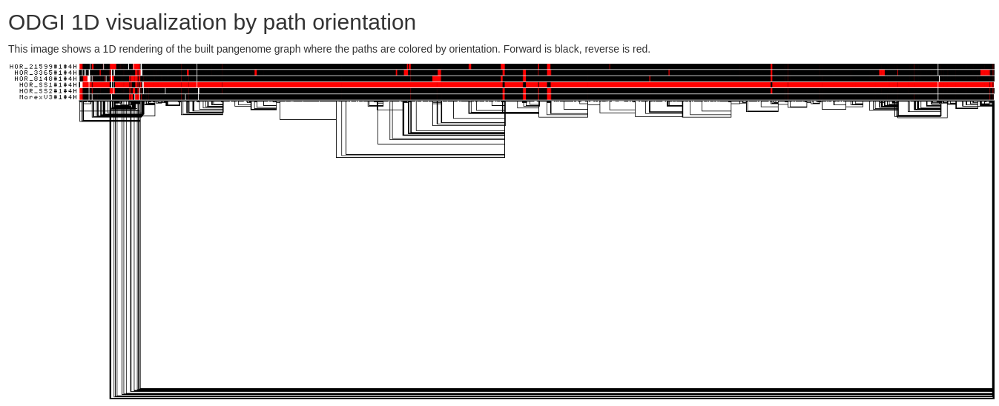

# Building the barley pangenome graph

## Get the assemblies

We will first create our working directory and copy here our assemblies

```
cd ~/Barley
mkdir pangenome
cd pangenome 
mkdir accessions
cd accessions
```

Download the other three assemblies we decided to use in this study:

```
# Morex - reference

wget https://ftp.ncbi.nlm.nih.gov/genomes/all/GCF/904/849/725/GCF_904849725.1_MorexV3_pseudomolecules_assembly/GCF_904849725.1_MorexV3_pseudomolecules_assembly_genomic.fna.gz

# Russian landrace - HOR 3365

wget https://ftp.ncbi.nlm.nih.gov/genomes/all/GCA/903/970/725/GCA_903970725.1_barley_shape_hor_3365/GCA_903970725.1_barley_shape_hor_3365_genomic.fna.gz

# Turkish landrace - HOR 8148 

wget https://ftp.ncbi.nlm.nih.gov/genomes/all/GCA/903/970/765/GCA_903970765.1_barley_shape_hor_8148/GCA_903970765.1_barley_shape_hor_8148_genomic.fna.gz

# Syrian landrace - HOR 21599

wget https://ftp.ncbi.nlm.nih.gov/genomes/all/GCA/903/970/735/GCA_903970735.1_barley_shape_hor_21599/GCA_903970735.1_barley_shape_hor_21599_genomic.fna.gz
```

## Standardise chromosome names

Our two Sardinian barleys have already the standard chromosome names for barley's chromosomes (1H,2H, etc.). For making the interpretation of the pangenome easier, I will standardise the names for the other assemblies as well.

### Morex

1H = NC_058518.1;
2H = NC_058519.1;
3H = NC_058520.1;
4H = NC_058521.1;
5H = NC_058522.1;
6H = NC_058523.1;
7H = NC_058524.1;

```
cd ~/Barley/pangenome/accessions
gunzip GCF_904849725.1_MorexV3_pseudomolecules_assembly_genomic.fna.gz

sed -e 's/^>NC_058518.1/>1H/' \
    -e 's/^>NC_058519.1/>2H/' \
    -e 's/^>NC_058520.1/>3H/' \
    -e 's/^>NC_058521.1/>4H/' \
    -e 's/^>NC_058522.1/>5H/' \
    -e 's/^>NC_058523.1/>6H/' \
    -e 's/^>NC_058524.1/>7H/' \
    GCF_904849725.1_MorexV3_pseudomolecules_assembly_genomic.fna > MorexV3_chr_named.fa
```

### Russian landrace - HOR 3365

1H = LR828139.1 \
2H = LR828140.1 \
3H = LR828141.1 \
4H = LR828142.1 \
5H = LR828143.1 \
6H = LR828144.1 \
7H = LR828145.1

```
cd ~/Barley/pangenome/accessions
gunzip GCA_903970725.1_barley_shape_hor_3365_genomic.fna.gz

sed -e 's/^>LR828139.1/>1H/' \
    -e 's/^>LR828140.1/>2H/' \
    -e 's/^>LR828141.1/>3H/' \
    -e 's/^>LR828142.1/>4H/' \
    -e 's/^>LR828143.1/>5H/' \
    -e 's/^>LR828144.1/>6H/' \
    -e 's/^>LR828145.1/>7H/' \
    GCA_903970725.1_barley_shape_hor_3365_genomic.fna > HOR_3365_chr_named.fa
```


### Turkish landrace - HOR 8148 

1H = LR828174.1 \
2H = LR828175.1 \
3H = LR828176.1 \
4H = LR828177.1 \
5H = LR828178.1 \
6H = LR828179.1 \
7H = LR828180.1 

```
cd ~/Barley/pangenome/accessions
gunzip GCA_903970765.1_barley_shape_hor_8148_genomic.fna.gz

sed -e 's/^>LR828174.1/>1H/' \
    -e 's/^>LR828175.1/>2H/' \
    -e 's/^>LR828176.1/>3H/' \
    -e 's/^>LR828177.1/>4H/' \
    -e 's/^>LR828178.1/>5H/' \
    -e 's/^>LR828179.1/>6H/' \
    -e 's/^>LR828180.1/>7H/' \
    GCA_903970765.1_barley_shape_hor_8148_genomic.fna > HOR_8148_chr_named.fa
```


### Syrian landrace - HOR 21599

1H = LR828160.1 \
2H = LR828161.1 \
3H = LR828162.1 \
4H = LR828163.1 \
5H = LR828164.1 \
6H = LR828165.1 \
7H = LR828166.1 

```
cd ~/Barley/pangenome/accessions
gunzip GCA_903970735.1_barley_shape_hor_21599_genomic.fna.gz 

sed -e 's/^>LR828160.1/>1H/' \
    -e 's/^>LR828161.1/>2H/' \
    -e 's/^>LR828162.1/>3H/' \
    -e 's/^>LR828163.1/>4H/' \
    -e 's/^>LR828164.1/>5H/' \
    -e 's/^>LR828165.1/>6H/' \
    -e 's/^>LR828166.1/>7H/' \
    GCA_903970735.1_barley_shape_hor_21599_genomic.fna > HOR_21599_chr_named.fa
```

## Exclude all non chromosome-length scaffolds


```
mamba activate seqkit

seqkit grep -r -p '^[1-7]H' HOR_SS1_chr_named.fa -o HOR_SS1.fa

seqkit grep -r -p '^[1-7]H' HOR_SS2_chr_named.fa -o HOR_SS2.fa

seqkit grep -r -p '^[1-7]H' MorexV3_chr_named.fa -o MorexV3.fa

seqkit grep -r -p '^[1-7]H' HOR_3365_chr_named.fa -o HOR_3365.fa

seqkit grep -r -p '^[1-7]H' HOR_8148_chr_named.fa -o HOR_8148.fa

seqkit grep -r -p '^[1-7]H' HOR_21599_chr_named.fa -o HOR_21599.fa
```

We can now clean up the directory and zip the assemblies we are going to use:

```
rm GC*
rm *named.fa

for i in *.fa ; do (echo "gzip $i"); done | bash
```

## Renaming assemblies according to PanSN-spec

To change the sequence names according to [PanSN-spec](https://github.com/pangenome/PanSN-spec), we can use [fastix](https://github.com/ekg/fastix):

```
ls *.fa | while read f; do
    sample_name=$(echo $f | cut -f 1 -d '.');
    echo ${sample_name}
    fastix -p "${sample_name}#1#" $f >> Barley.pg.in.fasta
done
```

With `"${sample_name}#1#"` we specify haplotype_id equals to 1 for all the assemblies, as they are all haploid.
The names of the scaffolds are now following the pattern:

`[sample_name][delim][haplotype_id][delim][contig_or_scaffold_name]`

We first have to compress our input fasta and index it:

```
cd ~/Barley/pangenome/accessions
bgzip -@ 20 Barley.pg.in.fasta
samtools faidx Barley.pg.in.fasta.gz
```

# Sequence divergence estimation

Since we standardised the names of the chromosomes, we can estimate the sequence divergence, as explained [here](https://pggb.readthedocs.io/en/latest/rst/tutorials/divergence_estimation.html) before running partition-before-pggb.

```
cd ~/Barley/pangenome/
mkdir seq_divergence_est
cd seq_divergence_est
ln -s ~/Barley/pangenome/accessions/*pg.in* ./


screen -S seq_div_barley
mamba activate pangenomics
```

Assuming we will work with one chromosome at a time, we estimate the sequence divergence for each set of chromosomes. To partition the sequences by chromosome, execute:

```
# place this into a script called partition_seq_by_chr.sh:

#!/bin/bash

cut -f 1 Barley.pg.in.fasta.gz.fai | cut -f 3 -d '#' | sort | uniq | while read CHROM; do
    CHR_FASTA=Barley.$CHROM.fasta.gz
    samtools faidx Barley.pg.in.fasta.gz $(grep -P $"$CHROM\t" Barley.pg.in.fasta.gz.fai | cut -f 1) | bgzip -@ 20 > $CHR_FASTA

    echo "Generated $CHR_FASTA"
done


chmod +x partition_seq_by_chr.sh

./partition_seq_by_chr.sh
```

To compute the maximum divergence for each set of chromosomes, execute:
```
# place this into a script called get_max_div.sh:

#!/bin/bash

ls Barley.*.fasta.gz | while read CHR_FASTA; do
    CHROM=$(echo $CHR_FASTA | cut -f 2 -d '.')
    MAX_DIVERGENCE=$(mash triangle -p 50 $CHR_FASTA | sed 1,1d | tr '\t' '\n' | grep chr -v | LC_ALL=C  sort -g -k 1nr | uniq | head -n 1)

    echo -e "$CHROM\t$MAX_DIVERGENCE" >> Barley.pg.in.divergence.txt
done

chmod +x get_max_div.sh

./get_max_div.sh

cat Barley.pg.in.txt | column -t
```

These are our results:

1H      0.00989629 \
2H      0.0117112 \
3H      0.0126347 \
4H      0.00752278 \
5H      0.0135016 \
6H      0.0117564 \
7H      0.012872


The most divergent chromosome seem to be 5H. Our max divergence will be (0.0135016 * 100) = 1.35016; 100 - 1.35016 = 98.64984
So, we can start with -p 95 with `partition-before-pggb`. 


## Sequence partitioning using partition-before-pggb

```
cd ~/Barley/pangenome/

mkdir pggb_build
cd pggb_build

ln -s ~/Barley/pangenome/accessions/*pg.in* ./
mkdir temp

screen -S partition_pggb
mamba activate pangenomics

partition-before-pggb -i Barley.pg.in.fasta.gz -o output_pbp_p95 -n 6 -t 100 -p 95 -s 20k -V 'MorexV3:#:10000' -m -D ./temp  
```

Finished! With 7 communities! :)

```
screen -r partition_pggb
pggb -i output_pbp_p95/Barley.pg.in.fasta.gz.fde3574.community.0.fa \
     -o output_pbp_p95/Barley.pg.in.fasta.gz.fde3574.community.0.fa.out \
     -s 20000 -l 100000 -p 95 -c 1 -K 19 -F 0.001 -g 30 \
     -k 23 -f 0 -B 10M \
     -n 6 -j 0 -e 0 -G 700,900,1100 -P 1,19,39,3,81,1 -O 0.001 -d 100 -Q Consensus_ \
     -Y "#" -V MorexV3:#:10000 --multiqc --temp-dir ./temp --threads 100 --poa-threads 100

pggb -i output_pbp_p95/Barley.pg.in.fasta.gz.fde3574.community.1.fa \
     -o output_pbp_p95/Barley.pg.in.fasta.gz.fde3574.community.1.fa.out \
     -s 20000 -l 100000 -p 95 -c 1 -K 19 -F 0.001 -g 30 \
     -k 23 -f 0 -B 10M \
     -n 6 -j 0 -e 0 -G 700,900,1100 -P 1,19,39,3,81,1 -O 0.001 -d 100 -Q Consensus_ \
     -Y "#" -V MorexV3:#:10000 --multiqc --temp-dir ./temp --threads 100 --poa-threads 100

pggb -i output_pbp_p95/Barley.pg.in.fasta.gz.fde3574.community.2.fa \
     -o output_pbp_p95/Barley.pg.in.fasta.gz.fde3574.community.2.fa.out \
     -s 20000 -l 100000 -p 95 -c 1 -K 19 -F 0.001 -g 30 \
     -k 23 -f 0 -B 10M \
     -n 6 -j 0 -e 0 -G 700,900,1100 -P 1,19,39,3,81,1 -O 0.001 -d 100 -Q Consensus_ \
     -Y "#" -V MorexV3:#:10000 --multiqc --temp-dir ./temp --threads 100 --poa-threads 100

pggb -i output_pbp_p95/Barley.pg.in.fasta.gz.fde3574.community.3.fa \
     -o output_pbp_p95/Barley.pg.in.fasta.gz.fde3574.community.3.fa.out \
     -s 20000 -l 100000 -p 95 -c 1 -K 19 -F 0.001 -g 30 \
     -k 23 -f 0 -B 10M \
     -n 6 -j 0 -e 0 -G 700,900,1100 -P 1,19,39,3,81,1 -O 0.001 -d 100 -Q Consensus_ \
     -Y "#" -V MorexV3:#:10000 --multiqc --temp-dir ./temp --threads 100 --poa-threads 100

pggb -i output_pbp_p95/Barley.pg.in.fasta.gz.fde3574.community.4.fa \
     -o output_pbp_p95/Barley.pg.in.fasta.gz.fde3574.community.4.fa.out \
     -s 20000 -l 100000 -p 95 -c 1 -K 19 -F 0.001 -g 30 \
     -k 23 -f 0 -B 10M \
     -n 6 -j 0 -e 0 -G 700,900,1100 -P 1,19,39,3,81,1 -O 0.001 -d 100 -Q Consensus_ \
     -Y "#" -V MorexV3:#:10000 --multiqc --temp-dir ./temp --threads 100 --poa-threads 100

pggb -i output_pbp_p95/Barley.pg.in.fasta.gz.fde3574.community.5.fa \
     -o output_pbp_p95/Barley.pg.in.fasta.gz.fde3574.community.5.fa.out \
     -s 20000 -l 100000 -p 95 -c 1 -K 19 -F 0.001 -g 30 \
     -k 23 -f 0 -B 10M \
     -n 6 -j 0 -e 0 -G 700,900,1100 -P 1,19,39,3,81,1 -O 0.001 -d 100 -Q Consensus_ \
     -Y "#" -V MorexV3:#:10000 --multiqc --temp-dir ./temp --threads 100 --poa-threads 100

pggb -i output_pbp_p95/Barley.pg.in.fasta.gz.fde3574.community.6.fa \
     -o output_pbp_p95/Barley.pg.in.fasta.gz.fde3574.community.6.fa.out \
     -s 20000 -l 100000 -p 95 -c 1 -K 19 -F 0.001 -g 30 \
     -k 23 -f 0 -B 10M \
     -n 6 -j 0 -e 0 -G 700,900,1100 -P 1,19,39,3,81,1 -O 0.001 -d 100 -Q Consensus_ \
     -Y "#" -V MorexV3:#:10000 --multiqc --temp-dir ./temp --threads 100 --poa-threads 100
```

# Pangenome annotation

## Get odgi untangle for annotation

Now, we should switch to odgi for annotation version.

```
cd ~/software
cd odgi
git checkout untangle_for_annotation && git pull && git submodule update --init --recursive
cmake -H. -Bbuild && cmake --build build -- -j 16
```

## Prepare the annotation file for injection

## download reference annotations

```
cd ~/Barley/pangenome/pggb_build
wget https://ftp.ncbi.nlm.nih.gov/genomes/all/GCF/904/849/725/GCF_904849725.1_MorexV3_pseudomolecules_assembly/GCF_904849725.1_MorexV3_pseudomolecules_assembly_genomic.gff.gz

gunzip GCF_904849725.1_MorexV3_pseudomolecules_assembly_genomic.gff.gz
```

This is how our annotations look like:
```
##gff-version 3
#!gff-spec-version 1.21
#!processor NCBI annotwriter
#!genome-build MorexV3_pseudomolecules_assembly
#!genome-build-accession NCBI_Assembly:GCF_904849725.1
#!annotation-source NCBI Hordeum vulgare subsp. vulgare Annotation Release 100
##sequence-region NC_058518.1 1 516505932
##species https://www.ncbi.nlm.nih.gov/Taxonomy/Browser/wwwtax.cgi?id=112509
NC_058518.1	RefSeq	region	1	516505932	.	+	.	ID=NC_058518.1:1..516505932;Dbxref=taxon:112509;Name=1H;chromosome=1H;gbkey=Src;genome=chromosome;mol_type=genomic DNA;sub-species=vulgare
NC_058518.1	Gnomon	gene	49524	50597	.	+	.	ID=gene-LOC123403204;Dbxref=GeneID:123403204;Name=LOC123403204;gbkey=Gene;gene=LOC123403204;gene_biotype=protein_coding
(pangenomics) [lia@sdf-cs1 pggb_build]$ head GCF_904849725.1_MorexV3_pseudomolecules_assembly_genomic.gff  -n 20
##gff-version 3
#!gff-spec-version 1.21
#!processor NCBI annotwriter
#!genome-build MorexV3_pseudomolecules_assembly
#!genome-build-accession NCBI_Assembly:GCF_904849725.1
#!annotation-source NCBI Hordeum vulgare subsp. vulgare Annotation Release 100
##sequence-region NC_058518.1 1 516505932
##species https://www.ncbi.nlm.nih.gov/Taxonomy/Browser/wwwtax.cgi?id=112509
NC_058518.1	RefSeq	region	1	516505932	.	+	.	ID=NC_058518.1:1..516505932;Dbxref=taxon:112509;Name=1H;chromosome=1H;gbkey=Src;genome=chromosome;mol_type=genomic DNA;sub-species=vulgare
NC_058518.1	Gnomon	gene	49524	50597	.	+	.	ID=gene-LOC123403204;Dbxref=GeneID:123403204;Name=LOC123403204;gbkey=Gene;gene=LOC123403204;gene_biotype=protein_coding
NC_058518.1	Gnomon	mRNA	49524	50597	.	+	.	ID=rna-XM_045097156.1;Parent=gene-LOC123403204;Dbxref=GeneID:123403204,GenBank:XM_045097156.1;Name=XM_045097156.1;experiment=COORDINATES: polyA evidence [ECO:0006239];gbkey=mRNA;gene=LOC123403204;model_evidence=Supporting evidence includes similarity to: 1 mRNA%2C 62 ESTs%2C 8 Proteins%2C and 100%25 coverage of the annotated genomic feature by RNAseq alignments%2C including 150 samples with support for all annotated introns;product=50S ribosomal protein L28%2C chloroplastic;transcript_id=XM_045097156.1
NC_058518.1	Gnomon	exon	49524	49772	.	+	.	ID=exon-XM_045097156.1-1;Parent=rna-XM_045097156.1;Dbxref=GeneID:123403204,GenBank:XM_045097156.1;experiment=COORDINATES: polyA evidence [ECO:0006239];gbkey=mRNA;gene=LOC123403204;product=50S ribosomal protein L28%2C chloroplastic;transcript_id=XM_045097156.1
NC_058518.1	Gnomon	exon	50195	50597	.	+	.	ID=exon-XM_045097156.1-2;Parent=rna-XM_045097156.1;Dbxref=GeneID:123403204,GenBank:XM_045097156.1;experiment=COORDINATES: polyA evidence [ECO:0006239];gbkey=mRNA;gene=LOC123403204;product=50S ribosomal protein L28%2C chloroplastic;transcript_id=XM_045097156.1
NC_058518.1	Gnomon	CDS	49583	49772	.	+	0	ID=cds-XP_044953091.1;Parent=rna-XM_045097156.1;Dbxref=GeneID:123403204,GenBank:XP_044953091.1;Name=XP_044953091.1;gbkey=CDS;gene=LOC123403204;product=50S ribosomal protein L28%2C chloroplastic;protein_id=XP_044953091.1
NC_058518.1	Gnomon	CDS	50195	50427	.	+	2	ID=cds-XP_044953091.1;Parent=rna-XM_045097156.1;Dbxref=GeneID:123403204,GenBank:XP_044953091.1;Name=XP_044953091.1;gbkey=CDS;gene=LOC123403204;product=50S ribosomal protein L28%2C chloroplastic;protein_id=XP_044953091.1
NC_058518.1	Gnomon	gene	76180	77806	.	+	.	ID=gene-LOC123394902;Dbxref=GeneID:123394902;Name=LOC123394902;gbkey=Gene;gene=LOC123394902;gene_biotype=protein_coding
NC_058518.1	Gnomon	mRNA	76180	77806	.	+	.	ID=rna-XM_045092618.1;Parent=gene-LOC123394902;Dbxref=GeneID:123394902,GenBank:XM_045092618.1;Name=XM_045092618.1;experiment=COORDINATES: polyA evidence [ECO:0006239];gbkey=mRNA;gene=LOC123394902;model_evidence=Supporting evidence includes similarity to: 2 Proteins%2C and 100%25 coverage of the annotated genomic feature by RNAseq alignments%2C including 118 samples with support for all annotated introns;product=uncharacterized LOC123394902;transcript_id=XM_045092618.1
NC_058518.1	Gnomon	exon	76180	77431	.	+	.	ID=exon-XM_045092618.1-1;Parent=rna-XM_045092618.1;Dbxref=GeneID:123394902,GenBank:XM_045092618.1;experiment=COORDINATES: polyA evidence [ECO:0006239];gbkey=mRNA;gene=LOC123394902;product=uncharacterized LOC123394902;transcript_id=XM_045092618.1
NC_058518.1	Gnomon	exon	77538	77806	.	+	.	ID=exon-XM_045092618.1-2;Parent=rna-XM_045092618.1;Dbxref=GeneID:123394902,GenBank:XM_045092618.1;experiment=COORDINATES: polyA evidence [ECO:0006239];gbkey=mRNA;gene=LOC123394902;product=uncharacterized LOC123394902;transcript_id=XM_045092618.1
NC_058518.1	Gnomon	CDS	76195	77373	.	+	0	ID=cds-XP_044948553.1;Parent=rna-XM_045092618.1;Dbxref=GeneID:123394902,GenBank:XP_044948553.1;Name=XP_044948553.1;gbkey=CDS;gene=LOC123394902;product=uncharacterized protein LOC123394902;protein_id=XP_044948553.1
```

## Adjust the annotation file format

I think that also in this case it can be beneficial to use the standard names for the chromosomes rather than their RefSeq. We also need to follow the pangenome naming. We can substitute the names as we did for the fasta file:

```
cd ~/Barley/pangenome/pggb_build

sed -e 's/^NC_058518.1/MorexV3#1#1H/' \
    -e 's/^NC_058519.1/MorexV3#1#2H/' \
    -e 's/^NC_058520.1/MorexV3#1#3H/' \
    -e 's/^NC_058521.1/MorexV3#1#4H/' \
    -e 's/^NC_058522.1/MorexV3#1#5H/' \
    -e 's/^NC_058523.1/MorexV3#1#6H/' \
    -e 's/^NC_058524.1/MorexV3#1#7H/' \
    GCF_904849725.1_MorexV3_pseudomolecules_assembly_genomic.gff > MorexV3_annotations.gff
```

Now they look like this:

```
##gff-version 3
#!gff-spec-version 1.21
#!processor NCBI annotwriter
#!genome-build MorexV3_pseudomolecules_assembly
#!genome-build-accession NCBI_Assembly:GCF_904849725.1
#!annotation-source NCBI Hordeum vulgare subsp. vulgare Annotation Release 100
##sequence-region NC_058518.1 1 516505932
##species https://www.ncbi.nlm.nih.gov/Taxonomy/Browser/wwwtax.cgi?id=112509
MorexV3#1#1H	RefSeq	region	1	516505932	.	+	.	ID=NC_058518.1:1..516505932;Dbxref=taxon:112509;Name=1H;chromosome=1H;gbkey=Src;genome=chromosome;mol_type=genomic DNA;sub-species=vulgare
MorexV3#1#1H	Gnomon	gene	49524	50597	.	+	.	ID=gene-LOC123403204;Dbxref=GeneID:123403204;Name=LOC123403204;gbkey=Gene;gene=LOC123403204;gene_biotype=protein_coding
MorexV3#1#1H	Gnomon	mRNA	49524	50597	.	+	.	ID=rna-XM_045097156.1;Parent=gene-LOC123403204;Dbxref=GeneID:123403204,GenBank:XM_045097156.1;Name=XM_045097156.1;experiment=COORDINATES: polyA evidence [ECO:0006239];gbkey=mRNA;gene=LOC123403204;model_evidence=Supporting evidence includes similarity to: 1 mRNA%2C 62 ESTs%2C 8 Proteins%2C and 100%25 coverage of the annotated genomic feature by RNAseq alignments%2C including 150 samples with support for all annotated introns;product=50S ribosomal protein L28%2C chloroplastic;transcript_id=XM_045097156.1
MorexV3#1#1H	Gnomon	exon	49524	49772	.	+	.	ID=exon-XM_045097156.1-1;Parent=rna-XM_045097156.1;Dbxref=GeneID:123403204,GenBank:XM_045097156.1;experiment=COORDINATES: polyA evidence [ECO:0006239];gbkey=mRNA;gene=LOC123403204;product=50S ribosomal protein L28%2C chloroplastic;transcript_id=XM_045097156.1
MorexV3#1#1H	Gnomon	exon	50195	50597	.	+	.	ID=exon-XM_045097156.1-2;Parent=rna-XM_045097156.1;Dbxref=GeneID:123403204,GenBank:XM_045097156.1;experiment=COORDINATES: polyA evidence [ECO:0006239];gbkey=mRNA;gene=LOC123403204;product=50S ribosomal protein L28%2C chloroplastic;transcript_id=XM_045097156.1
MorexV3#1#1H	Gnomon	CDS	49583	49772	.	+	0	ID=cds-XP_044953091.1;Parent=rna-XM_045097156.1;Dbxref=GeneID:123403204,GenBank:XP_044953091.1;Name=XP_044953091.1;gbkey=CDS;gene=LOC123403204;product=50S ribosomal protein L28%2C chloroplastic;protein_id=XP_044953091.1
MorexV3#1#1H	Gnomon	CDS	50195	50427	.	+	2	ID=cds-XP_044953091.1;Parent=rna-XM_045097156.1;Dbxref=GeneID:123403204,GenBank:XP_044953091.1;Name=XP_044953091.1;gbkey=CDS;gene=LOC123403204;product=50S ribosomal protein L28%2C chloroplastic;protein_id=XP_044953091.1
MorexV3#1#1H	Gnomon	gene	76180	77806	.	+	.	ID=gene-LOC123394902;Dbxref=GeneID:123394902;Name=LOC123394902;gbkey=Gene;gene=LOC123394902;gene_biotype=protein_coding
MorexV3#1#1H	Gnomon	mRNA	76180	77806	.	+	.	ID=rna-XM_045092618.1;Parent=gene-LOC123394902;Dbxref=GeneID:123394902,GenBank:XM_045092618.1;Name=XM_045092618.1;experiment=COORDINATES: polyA evidence [ECO:0006239];gbkey=mRNA;gene=LOC123394902;model_evidence=Supporting evidence includes similarity to: 2 Proteins%2C and 100%25 coverage of the annotated genomic feature by RNAseq alignments%2C including 118 samples with support for all annotated introns;product=uncharacterized LOC123394902;transcript_id=XM_045092618.1
MorexV3#1#1H	Gnomon	exon	76180	77431	.	+	.	ID=exon-XM_045092618.1-1;Parent=rna-XM_045092618.1;Dbxref=GeneID:123394902,GenBank:XM_045092618.1;experiment=COORDINATES: polyA evidence [ECO:0006239];gbkey=mRNA;gene=LOC123394902;product=uncharacterized LOC123394902;transcript_id=XM_045092618.1
MorexV3#1#1H	Gnomon	exon	77538	77806	.	+	.	ID=exon-XM_045092618.1-2;Parent=rna-XM_045092618.1;Dbxref=GeneID:123394902,GenBank:XM_045092618.1;experiment=COORDINATES: polyA evidence [ECO:0006239];gbkey=mRNA;gene=LOC123394902;product=uncharacterized LOC123394902;transcript_id=XM_045092618.1
MorexV3#1#1H	Gnomon	CDS	76195	77373	.	+	0	ID=cds-XP_044948553.1;Parent=rna-XM_045092618.1;Dbxref=GeneID:123394902,GenBank:XP_044948553.1;Name=XP_044948553.1;gbkey=CDS;gene=LOC123394902;product=uncharacterized protein LOC123394902;protein_id=XP_044948553.1
```

In order to inject the genes in the pangenome, we need to extract the information we need from the gff, and modify them according to the PanSN-spec naming:

```
#chr1 

awk -F "\t|ID=gene-|;Dbxref" '$1 ~/^MorexV3#1#1H$/ && $3 ~/^gene$/ {print ($1"\t"$4"\t"$5"\t""1H_"$10":"$4"-"$5)}' MorexV3_annotations.gff > chr1.Morex.bed

#chr2

awk -F "\t|ID=gene-|;Dbxref" '$1 ~/^MorexV3#1#2H$/ && $3 ~/^gene$/ {print ($1"\t"$4"\t"$5"\t""2H_"$10":"$4"-"$5)}' MorexV3_annotations.gff > chr2.Morex.bed

#chr3

awk -F "\t|ID=gene-|;Dbxref" '$1 ~/^MorexV3#1#3H$/ && $3 ~/^gene$/ {print ($1"\t"$4"\t"$5"\t""3H_"$10":"$4"-"$5)}' MorexV3_annotations.gff > chr3.Morex.bed

#chr4

awk -F "\t|ID=gene-|;Dbxref" '$1 ~/^MorexV3#1#4H$/ && $3 ~/^gene$/ {print ($1"\t"$4"\t"$5"\t""4H_"$10":"$4"-"$5)}' MorexV3_annotations.gff > chr4.Morex.bed

#chr5

awk -F "\t|ID=gene-|;Dbxref" '$1 ~/^MorexV3#1#5H$/ && $3 ~/^gene$/ {print ($1"\t"$4"\t"$5"\t""5H_"$10":"$4"-"$5)}' MorexV3_annotations.gff > chr5.Morex.bed

#chr6

awk -F "\t|ID=gene-|;Dbxref" '$1 ~/^MorexV3#1#6H$/ && $3 ~/^gene$/ {print ($1"\t"$4"\t"$5"\t""6H_"$10":"$4"-"$5)}' MorexV3_annotations.gff > chr6.Morex.bed

#chr7

awk -F "\t|ID=gene-|;Dbxref" '$1 ~/^MorexV3#1#7H$/ && $3 ~/^gene$/ {print ($1"\t"$4"\t"$5"\t""7H_"$10":"$4"-"$5)}' MorexV3_annotations.gff > chr7.Morex.bed
```

## Inject annotations in the pangenome graph

### chr1

```
cd ~Barley/pangenome/pggb_build/output_pbp_p95/Barley.pg.in.fasta.gz.fde3574.community.0.fa.out

mkdir annotation
cd annotation

ln -s ../Barley.pg.in.fasta.gz.fde3574.community.0.fa.fde3574.eb0f3d3.dcef834.smooth.final.og Barley.community.0.og
ln -s ~/Barley/pangenome/pggb_build/chr1.Morex.bed

# to be sure we have chr1 here:

odgi paths -i Barley.community.0.og -Ll

screen -S barley_annotation_chr1

mamba activate pangenomics

srun --cpus-per-task 100 --mem 500G -t 10-00 odgi inject -i Barley.community.0.og -b chr1.Morex.bed -o Barley.community.0.inject.og -t 100 -P

```

Extract gene names from injected pangenome:

```
odgi paths -i Barley.community.0.inject.og -L | grep '^1H_' > chr1.genenames.txt

# security check
wc -l chr1.genenames.txt 
---
4816 chr1.genenames.txt

wc -l chr1.Morex.bed
---
4816 chr1.Morex.bed
```

### chr2

```
cd ~/Barley/pangenome/pggb_build/output_pbp_p95/Barley.pg.in.fasta.gz.fde3574.community.1.fa.out

mkdir annotation
cd annotation

ln -s ../Barley.pg.in.fasta.gz.fde3574.community.1.fa.fde3574.eb0f3d3.dcef834.smooth.final.og Barley.community.1.og
ln -s ~/Barley/pangenome/pggb_build/chr2.Morex.bed
```

From the initial 1D visualisation, this chromosome seem to be in reverse complement orientation in our assembly HOR_SS1:


It may be better to apply `odgi flip` before going ahead:

```
srun --cpus-per-task 100 --mem 500G odgi flip -i Barley.community.1.og -o Barley.community.1.flip.og -t 100
```

Let's visualise the graph again:

```
srun --cpus-per-task 100 --mem 500G odgi viz -i Barley.community.1.flip.og -o Barley.community.1.flip.png -z -t 100
```


Right, now we have the same orientation and we can go ahead with the annotation.

```
# to be sure we have chr2 here:

odgi paths -i Barley.community.1.flip.og -Ll

screen -S barley_annotation_chr2

mamba activate pangenomics

odgi inject -i Barley.community.1.flip.og -b chr2.Morex.bed -o Barley.community.1.flip.inject.og -t 100 -P

```

Extract gene names from injected pangenome:

```
odgi paths -i Barley.community.1.flip.inject.og -L | grep '^2H_' > chr2.genenames.txt

# security check
wc -l chr2.genenames.txt 
---
12638 chr2.genenames.txt

wc -l chr2.Morex.bed
---
12638 chr2.Morex.bed
```


### chr3

```
cd ~/Barley/pangenome/pggb_build/output_pbp_p95/Barley.pg.in.fasta.gz.fde3574.community.2.fa.out

mkdir annotation
cd annotation

ln -s ../Barley.pg.in.fasta.gz.fde3574.community.2.fa.fde3574.eb0f3d3.dcef834.smooth.final.og Barley.community.2.og
ln -s ~/Barley/pangenome/pggb_build/chr3.Morex.bed

# to be sure we have chr3 here:

odgi paths -i Barley.community.2.og -Ll

screen -S barley_annotation_chr3

mamba activate pangenomics

odgi inject -i Barley.community.2.og -b chr3.Morex.bed -o Barley.community.2.inject.og -t 100 -P

```

Extract gene names from injected pangenome:

```
odgi paths -i Barley.community.2.inject.og -L | grep '^3H_' > chr3.genenames.txt

# security check
wc -l chr3.genenames.txt 
---
5622 chr3.genenames.txt

wc -l chr3.Morex.bed
---
5622 chr3.Morex.bed
```


### chr4

```
cd ~/Barley/pangenome/pggb_build/output_pbp_p95/Barley.pg.in.fasta.gz.fde3574.community.3.fa.out

mkdir annotation
cd annotation

ln -s ../Barley.pg.in.fasta.gz.fde3574.community.3.fa.fde3574.eb0f3d3.dcef834.smooth.final.og Barley.community.3.og
ln -s ~/Barley/pangenome/pggb_build/chr4.Morex.bed
```

From the initial 1D visualisation, this chromosome seem to be in reverse complement orientation in our assembly HOR_SS1:



It may be better to apply `odgi flip` before going ahead:

```
odgi flip -i Barley.community.3.og -o Barley.community.3.flip.og -t 100
```

Let's visualise the graph again:

```
odgi viz -i Barley.community.3.flip.og -o Barley.community.3.flip.png -z -t 100
```


Right, now we have the same orientation and we can go ahead with the annotation.

```
# to be sure we have chr4 here:

odgi paths -i Barley.community.3.flip.og -Ll

screen -S barley_annotation_chr4

mamba activate pangenomics

odgi inject -i Barley.community.3.flip.og -b chr4.Morex.bed -o Barley.community.3.flip.inject.og -t 100 -P

```

Extract gene names from injected pangenome:

```
odgi paths -i Barley.community.3.flip.inject.og -L | grep '^4H_' > chr4.genenames.txt

# security check
wc -l chr4.genenames.txt 
---
4459 chr4.genenames.txt

wc -l chr4.Morex.bed
---
4459 chr4.Morex.bed
```

### chr5

```
cd ~/Barley/pangenome/pggb_build/output_pbp_p95/Barley.pg.in.fasta.gz.fde3574.community.4.fa.out

mkdir annotation
cd annotation

ln -s ../Barley.pg.in.fasta.gz.fde3574.community.4.fa.fde3574.eb0f3d3.dcef834.smooth.final.og Barley.community.4.og
ln -s ~/Barley/pangenome/pggb_build/chr5.Morex.bed
```

From the initial 1D visualisation, this chromosome seem to be in reverse complement orientation in our assembly HOR_SS2:


It may be better to apply `odgi flip` before going ahead:

```
srun --cpus-per-task 100 --mem 500G odgi flip -i Barley.community.4.og -o Barley.community.4.flip.og -t 100
```

Let's visualise the graph again:

```
srun --cpus-per-task 100 --mem 500G odgi viz -i Barley.community.4.flip.og -o Barley.community.4.flip.png -z -t 100
```


Right, now we have the same orientation and we can go ahead with the annotation.

```
# to be sure we have chr5 here:

odgi paths -i Barley.community.4.flip.og -Ll

screen -S barley_annotation_chr5

mamba activate pangenomics

odgi inject -i Barley.community.4.flip.og -b chr5.Morex.bed -o Barley.community.4.flip.inject.og -t 100 -P

```

Extract gene names from injected pangenome:

```
odgi paths -i Barley.community.4.flip.inject.og -L | grep '^5H_' > chr5.genenames.txt

# security check
wc -l chr5.genenames.txt 
---
4459 chr5.genenames.txt

wc -l chr5.Morex.bed
---
4459 chr5.Morex.bed
```

### chr6

```
cd ~/Barley/pangenome/pggb_build/output_pbp_p95/Barley.pg.in.fasta.gz.fde3574.community.5.fa.out

mkdir annotation
cd annotation

ln -s ../Barley.pg.in.fasta.gz.fde3574.community.5.fa.fde3574.eb0f3d3.dcef834.smooth.final.og Barley.community.5.og
ln -s ~/Barley/pangenome/pggb_build/chr6.Morex.bed
```

From the initial 1D visualisation, this chromosome seem to be in reverse complement orientation in both our assemblies HOR_SS1 and HOR_SS2:


It may be better to apply `odgi flip` before going ahead:

```
odgi flip -i Barley.community.5.og -o Barley.community.5.flip.og -t 100
```

Let's visualise the graph again:

```
odgi viz -i Barley.community.5.flip.og -o Barley.community.5.flip.png -z -t 100
```


Right, now we have the same orientation and we can go ahead with the annotation.

```
# to be sure we have chr6 here:

odgi paths -i Barley.community.5.flip.og -Ll

screen -S barley_annotation_chr6

mamba activate pangenomics

odgi inject -i Barley.community.5.flip.og -b chr6.Morex.bed -o Barley.community.5.flip.inject.og -t 100 -P

```

Extract gene names from injected pangenome:

```
odgi paths -i Barley.community.5.flip.inject.og -L | grep '^6H_' > chr6.genenames.txt

# security check
wc -l chr6.genenames.txt 
---
4602 chr6.genenames.txt

wc -l chr6.Morex.bed
---
4602 chr5.Morex.bed
```


### chr7

```
cd ~/Barley/pangenome/pggb_build/output_pbp_p95/Barley.pg.in.fasta.gz.fde3574.community.6.fa.out

mkdir annotation
cd annotation

ln -s ../Barley.pg.in.fasta.gz.fde3574.community.6.fa.fde3574.eb0f3d3.dcef834.smooth.final.og Barley.community.6.og
ln -s ~/Barley/pangenome/pggb_build/chr7.Morex.bed
```

From the initial 1D visualisation, this chromosome seem to be in reverse complement orientation in both our assemblies HOR_SS1 and HOR_SS2:


It may be better to apply `odgi flip` before going ahead:

```
odgi flip -i Barley.community.6.og -o Barley.community.6.flip.og -t 100
```

Let's visualise the graph again:

```
odgi viz -i Barley.community.6.flip.og -o Barley.community.6.flip.png -z -t 100
```


Right, now we have the same orientation and we can go ahead with the annotation.

```
# to be sure we have chr7 here:

odgi paths -i Barley.community.6.flip.og -Ll

screen -S barley_annotation_chr7

mamba activate pangenomics

odgi inject -i Barley.community.6.flip.og -b chr7.Morex.bed -o Barley.community.6.flip.inject.og -t 100 -P
```

Extract gene names from injected pangenome:

```
odgi paths -i Barley.community.6.flip.inject.og -L | grep '^7H_' > chr7.genenames.txt

# security check
wc -l chr7.genenames.txt 
---
6510 chr7.genenames.txt

wc -l chr7.Morex.bed
---
6510 chr7.Morex.bed
```

## Untangle the genes across the assemblies

### chr1

```
odgi stepindex -i Barley.community.0.inject.og -o Barley.community.0.inject.og.index -t 100 -P

odgi untangle -i Barley.community.0.inject.og -a Barley.community.0.inject.og.index -R chr1.genenames.txt -j 0 -t 100 -P -p > Barley.community.0.inject.paf
```


### chr2

```
odgi stepindex -i Barley.community.1.flip.inject.og -o Barley.community.1.flip.inject.og.index -t 100 -P

odgi untangle -i Barley.community.1.flip.inject.og -a Barley.community.1.flip.inject.og.index -R chr2.genenames.txt -j 0 -t 100 -P -p > Barley.community.1.flip.inject.paf
```

### chr3

```
odgi stepindex -i Barley.community.2.inject.og -o Barley.community.2.inject.og.index -t 100 -P

odgi untangle -i Barley.community.2.inject.og -a Barley.community.2.inject.og.index -R chr3.genenames.txt -j 0 -t 100 -P -p > Barley.community.2.inject.paf
```

### chr4

```
odgi stepindex -i Barley.community.3.flip.inject.og -o Barley.community.3.flip.inject.og.index -t 100 -P

odgi untangle -i Barley.community.3.flip.inject.og -a Barley.community.3.flip.inject.og.index -R chr4.genenames.txt -j 0 -t 100 -P -p > Barley.community.3.flip.inject.paf
```

### chr5

```
odgi stepindex -i Barley.community.4.flip.inject.og -o Barley.community.4.flip.inject.og.index -t 100 -P

odgi untangle -i Barley.community.4.flip.inject.og -a Barley.community.4.flip.inject.og.index -R chr5.genenames.txt -j 0 -t 100 -P -p > Barley.community.4.flip.inject.paf
```

### chr6

```
odgi stepindex -i Barley.community.5.flip.inject.og -o Barley.community.5.flip.inject.og.index -t 100 -P

odgi untangle -i Barley.community.5.flip.inject.og -a Barley.community.5.flip.inject.og.index -R chr6.genenames.txt -j 0 -t 100 -P -p > Barley.community.5.flip.inject.paf
```

### chr7

```
odgi stepindex -i Barley.community.6.flip.inject.og -o Barley.community.6.flip.inject.og.index -t 100 -P

odgi untangle -i Barley.community.6.flip.inject.og -a Barley.community.6.flip.inject.og.index -R chr7.genenames.txt -j 0 -t 100 -P -p > Barley.community.6.flip.inject.paf
```

## Untangle processing

Before calculating the statistics about core, softcore, dispensable and private genes, we need to process untangle results (the paf file) with `collapse_paf.py` and `merge_paf.py` through the script `run_collapse_and_merge.sh` which were designed for the Arabidopsis pangenome.

```
#chr1


cd ~/Barley/pangenome/pggb_build/output_pbp_p95/Barley.pg.in.fasta.gz.fde3574.community.0.fa.out/annotation

mkdir collapse_and_merge
cd collapse_and_merge/

screen -S coll_barley_chr1

mamba activate pandas

~/software/scripts/run_collapse_and_merge.sh -i ../Barley.community.0.inject.paf -c ~/software/scripts/collapse_paf.py -m ~/software/scripts/merge_paf.py -d 100 -j 20


#chr2


cd ~/Barley/pangenome/pggb_build/output_pbp_p95/Barley.pg.in.fasta.gz.fde3574.community.1.fa.out/annotation

mkdir collapse_and_merge
cd collapse_and_merge/

mamba activate pandas

~/software/scripts/run_collapse_and_merge.sh -i ../Barley.community.1.flip.inject.paf -c ~/software/scripts/collapse_paf.py -m ~/software/scripts/merge_paf.py -d 100 -j 20


#chr3


cd ~/Barley/pangenome/pggb_build/output_pbp_p95/Barley.pg.in.fasta.gz.fde3574.community.2.fa.out/annotation

mkdir collapse_and_merge
cd collapse_and_merge/

mamba activate pandas

 ~/software/scripts/run_collapse_and_merge.sh -i ../Barley.community.2.inject.paf -c ~/software/scripts/collapse_paf.py -m ~/software/scripts/merge_paf.py -d 100 -j 20


#chr4


cd ~/Barley/pangenome/pggb_build/output_pbp_p95/Barley.pg.in.fasta.gz.fde3574.community.3.fa.out/annotation

mkdir collapse_and_merge
cd collapse_and_merge/

mamba activate pandas

 ~/software/scripts/run_collapse_and_merge.sh -i ../Barley.community.3.flip.inject.paf -c ~/software/scripts/collapse_paf.py -m ~/software/scripts/merge_paf.py -d 100 -j 20


#chr5


cd ~/Barley/pangenome/pggb_build/output_pbp_p95/Barley.pg.in.fasta.gz.fde3574.community.4.fa.out/annotation

mkdir collapse_and_merge
cd collapse_and_merge/

mamba activate pandas

 ~/software/scripts/run_collapse_and_merge.sh -i ../Barley.community.4.flip.inject.paf -c ~/software/scripts/collapse_paf.py -m ~/software/scripts/merge_paf.py -d 100 -j 20


#chr6


cd ~/Barley/pangenome/pggb_build/output_pbp_p95/Barley.pg.in.fasta.gz.fde3574.community.5.fa.out/annotation

mkdir collapse_and_merge
cd collapse_and_merge/

mamba activate pandas

 ~/software/scripts/run_collapse_and_merge.sh -i ../Barley.community.5.flip.inject.paf -c ~/software/scripts/collapse_paf.py -m ~/software/scripts/merge_paf.py -d 100 -j 20


#chr7


cd ~/Barley/pangenome/pggb_build/output_pbp_p95/Barley.pg.in.fasta.gz.fde3574.community.6.fa.out/annotation

mkdir collapse_and_merge
cd collapse_and_merge/

mamba activate pandas

 ~/software/scripts/run_collapse_and_merge.sh -i ../Barley.community.6.flip.inject.paf -c ~/software/scripts/collapse_paf.py -m ~/software/scripts/merge_paf.py -d 100 -j 20
```

## genes classification

To identify the coverage and ID thresholds to use, I'll first run core_dispensable.py (from Arabidopsis_pangenome) on the first chromosome using different settings, in order to plot the results.

Before proceeding, we need to slightly modify our input files to:
- remove 1H_,2H_ etc, from the `Feature` column in `collapsed_and_merged.paf`
- keep only 1H, 2H etc, as "chromosome" in the gff file `MorexV3_annotations.gff`


```
cd ~/Barley/pangenome/pggb_build
sed 's/^MorexV3#1#//g' MorexV3_annotations.gff > MorexV3_annotations_adj.gff
```

### chr1 

```
cd ~/Barley/pangenome/pggb_build/output_pbp_p95/Barley.pg.in.fasta.gz.fde3574.community.0.fa.out/annotation/collapse_and_merge
awk 'BEGIN{OFS=FS="\t"} {sub(/^1H_/, "", $6); print}' collapsed_and_merged.paf > collapsed_and_merged_adj.paf
```
```
cd ~/Barley/pangenome/pggb_build/output_pbp_p95/Barley.pg.in.fasta.gz.fde3574.community.0.fa.out/annotation/
mkdir core_dispensable && cd core_dispensable

mamba activate pandas

srun ~/software/scripts/core_dispensable_genes.py -i ../collapse_and_merge/collapsed_and_merged_adj.paf -id 95 -jc 0.95 -cov 95 -na 6 -sl 5 -gff ~/Barley/pangenome/pggb_build/MorexV3_annotations_adj.gff -ft gene
```


### chr2 

```
cd ~/Barley/pangenome/pggb_build/output_pbp_p95/Barley.pg.in.fasta.gz.fde3574.community.1.fa.out/annotation/collapse_and_merge
awk 'BEGIN{OFS=FS="\t"} {sub(/^2H_/, "", $6); print}' collapsed_and_merged.paf > collapsed_and_merged_adj.paf 

cd ~/Barley/pangenome/pggb_build/output_pbp_p95/Barley.pg.in.fasta.gz.fde3574.community.1.fa.out/annotation/
mkdir core_dispensable && cd core_dispensable

srun ~/software/scripts/core_dispensable_genes.py -i ../collapse_and_merge/collapsed_and_merged_adj.paf -id 95 -jc 0.95 -cov 95 -na 6 -sl 5 -gff ~/Barley/pangenome/pggb_build/MorexV3_annotations_adj.gff -ft gene
```


### chr3 

```
cd ~/Barley/pangenome/pggb_build/output_pbp_p95/Barley.pg.in.fasta.gz.fde3574.community.2.fa.out/annotation/collapse_and_merge
awk 'BEGIN{OFS=FS="\t"} {sub(/^3H_/, "", $6); print}' collapsed_and_merged.paf > collapsed_and_merged_adj.paf 

cd ~/Barley/pangenome/pggb_build/output_pbp_p95/Barley.pg.in.fasta.gz.fde3574.community.2.fa.out/annotation/
mkdir core_dispensable && cd core_dispensable

srun ~/software/scripts/core_dispensable_genes.py -i ../collapse_and_merge/collapsed_and_merged_adj.paf -id 95 -jc 0.95 -cov 95 -na 6 -sl 5 -gff ~/Barley/pangenome/pggb_build/MorexV3_annotations_adj.gff -ft gene
```

### chr4 

```
cd ~/Barley/pangenome/pggb_build/output_pbp_p95/Barley.pg.in.fasta.gz.fde3574.community.3.fa.out/annotation/collapse_and_merge
awk 'BEGIN{OFS=FS="\t"} {sub(/^4H_/, "", $6); print}' collapsed_and_merged.paf > collapsed_and_merged_adj.paf 

cd ~/Barley/pangenome/pggb_build/output_pbp_p95/Barley.pg.in.fasta.gz.fde3574.community.3.fa.out/annotation/
mkdir core_dispensable && cd core_dispensable

srun ~/software/scripts/core_dispensable_genes.py -i ../collapse_and_merge/collapsed_and_merged_adj.paf -id 95 -jc 0.95 -cov 95 -na 6 -sl 5 -gff ~/Barley/pangenome/pggb_build/MorexV3_annotations_adj.gff -ft gene
```


### chr5 

```
cd ~/Barley/pangenome/pggb_build/output_pbp_p95/Barley.pg.in.fasta.gz.fde3574.community.4.fa.out/annotation/collapse_and_merge
awk 'BEGIN{OFS=FS="\t"} {sub(/^5H_/, "", $6); print}' collapsed_and_merged.paf > collapsed_and_merged_adj.paf 

cd ~/Barley/pangenome/pggb_build/output_pbp_p95/Barley.pg.in.fasta.gz.fde3574.community.4.fa.out/annotation/
mkdir core_dispensable && cd core_dispensable

srun ~/software/scripts/core_dispensable_genes.py -i ../collapse_and_merge/collapsed_and_merged_adj.paf -id 95 -jc 0.95 -cov 95 -na 6 -sl 5 -gff ~/Barley/pangenome/pggb_build/MorexV3_annotations_adj.gff -ft gene
```


### chr6 

```
cd ~/Barley/pangenome/pggb_build/output_pbp_p95/Barley.pg.in.fasta.gz.fde3574.community.5.fa.out/annotation/collapse_and_merge
awk 'BEGIN{OFS=FS="\t"} {sub(/^6H_/, "", $6); print}' collapsed_and_merged.paf > collapsed_and_merged_adj.paf 

cd ~/Barley/pangenome/pggb_build/output_pbp_p95/Barley.pg.in.fasta.gz.fde3574.community.5.fa.out/annotation/
mkdir core_dispensable && cd core_dispensable

srun ~/software/scripts/core_dispensable_genes.py -i ../collapse_and_merge/collapsed_and_merged_adj.paf -id 95 -jc 0.95 -cov 95 -na 6 -sl 5 -gff ~/Barley/pangenome/pggb_build/MorexV3_annotations_adj.gff -ft gene
```


### chr7 

```
cd ~/Barley/pangenome/pggb_build/output_pbp_p95/Barley.pg.in.fasta.gz.fde3574.community.6.fa.out/annotation/collapse_and_merge
awk 'BEGIN{OFS=FS="\t"} {sub(/^7H_/, "", $6); print}' collapsed_and_merged.paf > collapsed_and_merged_adj.paf 

cd ~/Barley/pangenome/pggb_build/output_pbp_p95/Barley.pg.in.fasta.gz.fde3574.community.6.fa.out/annotation/
mkdir core_dispensable && cd core_dispensable

srun ~/software/scripts/core_dispensable_genes.py -i ../collapse_and_merge/collapsed_and_merged_adj.paf -id 95 -jc 0.95 -cov 95 -na 6 -sl 5 -gff ~/Barley/pangenome/pggb_build/MorexV3_annotations_adj.gff -ft gene
```

# Sequence based analisis

## graphs stats (odgi stats)

```
mamba activate pangenomics

# chr1

cd ~/Barley/pangenome/pggb_build/output_pbp_p95/Barley.pg.in.fasta.gz.fde3574.community.0.fa.out/

srun -t 1-15 odgi stats -i Barley.pg.in.fasta.gz.fde3574.community.0.fa.fde3574.eb0f3d3.dcef834.smooth.final.og -m > chr1_odgi_stats.yaml

#chr2

cd ~/Barley/pangenome/pggb_build/output_pbp_p95/Barley.pg.in.fasta.gz.fde3574.community.1.fa.out

srun -t 1-15 odgi stats -i Barley.pg.in.fasta.gz.fde3574.community.1.fa.fde3574.eb0f3d3.dcef834.smooth.final.og -m > chr2_odgi_stats.yaml

#chr3

cd ~/Barley/pangenome/pggb_build/output_pbp_p95/Barley.pg.in.fasta.gz.fde3574.community.2.fa.out

srun -t 1-15 odgi stats -i Barley.pg.in.fasta.gz.fde3574.community.2.fa.fde3574.eb0f3d3.dcef834.smooth.final.og -m > chr3_odgi_stats.yaml

#chr4

cd ~/Barley/pangenome/pggb_build/output_pbp_p95/Barley.pg.in.fasta.gz.fde3574.community.3.fa.out

srun -t 1-15 odgi stats -i Barley.pg.in.fasta.gz.fde3574.community.3.fa.fde3574.eb0f3d3.dcef834.smooth.final.og -m > chr4_odgi_stats.yaml

#chr5

cd ~/Barley/pangenome/pggb_build/output_pbp_p95/Barley.pg.in.fasta.gz.fde3574.community.4.fa.out

srun -t 1-15 odgi stats -i Barley.pg.in.fasta.gz.fde3574.community.4.fa.fde3574.eb0f3d3.dcef834.smooth.final.og -m > chr5_odgi_stats.yaml

#chr6

cd ~/Barley/pangenome/pggb_build/output_pbp_p95/Barley.pg.in.fasta.gz.fde3574.community.5.fa.out

srun -t 1-15 odgi stats -i Barley.pg.in.fasta.gz.fde3574.community.5.fa.fde3574.eb0f3d3.dcef834.smooth.final.og -m > chr6_odgi_stats.yaml

#chr7

cd ~/Barley/pangenome/pggb_build/output_pbp_p95/Barley.pg.in.fasta.gz.fde3574.community.6.fa.out

srun -t 1-15 odgi stats -i Barley.pg.in.fasta.gz.fde3574.community.6.fa.fde3574.eb0f3d3.dcef834.smooth.final.og -m > chr7_odgi_stats.yaml
```

## Node coverage matrices

```
screen -S barley_matrices

mamba activate pangenomics

# chr1

cd ~/Barley/pangenome/pggb_build/output_pbp_p95/Barley.pg.in.fasta.gz.fde3574.community.0.fa.out/

odgi paths -i Barley.pg.in.fasta.gz.fde3574.community.0.fa.fde3574.eb0f3d3.dcef834.smooth.final.og -H -D "#" -p1 -t 100 > chr1_node_matrix.txt

mamba deactivate

mamba activate pandas

mkdir node_matrix
cd node_matrix

~/software/scripts/node_matrix_processing.py -i ../chr1_node_matrix.txt -p chr1 -o chr1_matrix.csv -na 6 -sl 5

# chr2

cd ~/Barley/pangenome/pggb_build/output_pbp_p95/Barley.pg.in.fasta.gz.fde3574.community.1.fa.out/

mamba activate pangenomics

odgi paths -i annotation/Barley.community.1.flip.og -H -D "#" -p1 -t 100 > chr2_node_matrix.txt

mamba deactivate

mamba activate pandas

mkdir node_matrix
cd node_matrix

~/software/scripts/node_matrix_processing.py -i ../chr2_node_matrix.txt -p chr2 -o chr2_matrix.csv -na 6 -sl 5

# chr3

cd ~/Barley/pangenome/pggb_build/output_pbp_p95/Barley.pg.in.fasta.gz.fde3574.community.2.fa.out/

odgi paths -i Barley.pg.in.fasta.gz.fde3574.community.2.fa.fde3574.eb0f3d3.dcef834.smooth.final.og -H -D "#" -p1 -t 100 > chr3_node_matrix.txt

mamba deactivate

mamba activate pandas

mkdir node_matrix
cd node_matrix

~/software/scripts/node_matrix_processing.py -i ../chr3_node_matrix.txt -p chr3 -o chr3_matrix.csv -na 6 -sl 5

# chr4

cd ~/Barley/pangenome/pggb_build/output_pbp_p95/Barley.pg.in.fasta.gz.fde3574.community.3.fa.out/

odgi paths -i annotation/Barley.community.3.flip.og -H -D "#" -p1 -t 100 > chr4_node_matrix.txt

mamba deactivate

mamba activate pandas

mkdir node_matrix
cd node_matrix

~/software/scripts/node_matrix_processing.py -i ../chr4_node_matrix.txt -p chr4 -o chr4_matrix.csv -na 6 -sl 5

# chr5

cd ~/Barley/pangenome/pggb_build/output_pbp_p95/Barley.pg.in.fasta.gz.fde3574.community.4.fa.out/

odgi paths -i annotation/Barley.community.4.flip.og -H -D "#" -p1 -t 100 > chr5_node_matrix.txt

mamba deactivate

mamba activate pandas

mkdir node_matrix
cd node_matrix

~/software/scripts/node_matrix_processing.py -i ../chr5_node_matrix.txt -p chr5 -o chr5_matrix.csv -na 6 -sl 5

# chr6

cd ~/Barley/pangenome/pggb_build/output_pbp_p95/Barley.pg.in.fasta.gz.fde3574.community.5.fa.out/

odgi paths -i annotation/Barley.community.5.flip.og -H -D "#" -p1 -t 100 > chr6_node_matrix.txt

mamba deactivate

mamba activate pandas

mkdir node_matrix
cd node_matrix

~/software/scripts/node_matrix_processing.py -i ../chr6_node_matrix.txt -p chr6 -o chr6_matrix.csv -na 6 -sl 5

# chr7

cd ~/Barley/pangenome/pggb_build/output_pbp_p95/Barley.pg.in.fasta.gz.fde3574.community.6.fa.out/

odgi paths -i annotation/Barley.community.6.flip.og -H -D "#" -p1 -t 100 > chr7_node_matrix.txt

mamba deactivate

mamba activate pandas

mkdir node_matrix
cd node_matrix

~/software/scripts/node_matrix_processing.py -i ../chr7_node_matrix.txt -p chr7 -o chr7_matrix.csv -na 6 -sl 5
```

## Similarity

```
cd ~/Barley/pangenome/pggb_build/output_pbp_p95/

mkdir all_graphs
cd all_graphs
```

`odgi squeeze` needs a file with the list of the graphs as input

```
nano graphs.txt

~/Barley/pangenome/pggb_build/output_pbp_p95/Barley.pg.in.fasta.gz.fde3574.community.0.fa.out/Barley.pg.in.fasta.gz.fde3574.community.0.fa.fde3574.eb0f3d3.dcef834.smooth.final.og
~/Barley/pangenome/pggb_build/output_pbp_p95/Barley.pg.in.fasta.gz.fde3574.community.1.fa.out/annotation/Barley.community.1.flip.og
~/Barley/pangenome/pggb_build/output_pbp_p95/Barley.pg.in.fasta.gz.fde3574.community.2.fa.out/Barley.pg.in.fasta.gz.fde3574.community.2.fa.fde3574.eb0f3d3.dcef834.smooth.final.og
~/Barley/pangenome/pggb_build/output_pbp_p95/Barley.pg.in.fasta.gz.fde3574.community.3.fa.out/annotation/Barley.community.3.flip.og
~/Barley/pangenome/pggb_build/output_pbp_p95/Barley.pg.in.fasta.gz.fde3574.community.4.fa.out/annotation/Barley.community.4.flip.og
~/Barley/pangenome/pggb_build/output_pbp_p95/Barley.pg.in.fasta.gz.fde3574.community.5.fa.out/annotation/Barley.community.5.flip.og
~/Barley/pangenome/pggb_build/output_pbp_p95/Barley.pg.in.fasta.gz.fde3574.community.6.fa.out/annotation/Barley.community.6.flip.og
```

Squeeze:

```
screen -S squeeze

mamba activate pangenomics

odgi squeeze -f graphs.txt -o squeezed_pangenome.og -t 100 -P

odgi similarity -i squeezed_pangenome.og -D '#' -d -t 100 -P > similarity_nodes.tsv
```

## Get node length

I already have this info but I need to run this command for each community to get the length for each node.

```
cd ~/Barley/pangenome/pggb_build/output_pbp_p95/Barley.pg.in.fasta.gz.fde3574.community.0.fa.out/annotation
srun -t 1-15 --mem 200G odgi paths -i Barley.community.0.og --coverage-levels 2,5,6 > chr1_coverage_levels.txt

cd ~/Barley/pangenome/pggb_build/output_pbp_p95/Barley.pg.in.fasta.gz.fde3574.community.1.fa.out/annotation
srun -t 1-15 --mem 200G odgi paths -i Barley.community.1.flip.og --coverage-levels 2,5,6 > chr2_coverage_levels.txt

cd ~/Barley/pangenome/pggb_build/output_pbp_p95/Barley.pg.in.fasta.gz.fde3574.community.2.fa.out/annotation
srun -t 1-15 --mem 200G odgi paths -i Barley.community.2.og --coverage-levels 2,5,6 > chr3_coverage_levels.txt

cd ~/Barley/pangenome/pggb_build/output_pbp_p95/Barley.pg.in.fasta.gz.fde3574.community.3.fa.out/annotation
srun -t 1-15 --mem 200G odgi paths -i Barley.community.3.flip.og  --coverage-levels 2,5,6 > chr4_coverage_levels.txt

cd ~/Barley/pangenome/pggb_build/output_pbp_p95/Barley.pg.in.fasta.gz.fde3574.community.4.fa.out/annotation
srun -t 1-15 --mem 200G odgi paths -i Barley.community.4.flip.og  --coverage-levels 2,5,6 > chr5_coverage_levels.txt

cd ~/Barley/pangenome/pggb_build/output_pbp_p95/Barley.pg.in.fasta.gz.fde3574.community.5.fa.out/annotation
srun -t 1-15 --mem 200G odgi paths -i Barley.community.5.flip.og  --coverage-levels 2,5,6 > chr6_coverage_levels.txt

cd ~/Barley/pangenome/pggb_build/output_pbp_p95/Barley.pg.in.fasta.gz.fde3574.community.6.fa.out/annotation
srun -t 1-15 --mem 200G odgi paths -i Barley.community.6.flip.og  --coverage-levels 2,5,6 > chr7_coverage_levels.txt
```

calculate how many bp are coverd by each class (here we don't need any additional step as the number of assemblies = number of paths)

```
awk 'BEGIN{FS=OFS="\t"} {len[$3]+=$2} END{for (i in len) print i, len[i]}' chr1_coverage_levels.txt
---
c<2	243293357
5<=c<6	49277966
c>=6	376115287
2<=c<5	138957216

awk 'BEGIN{FS=OFS="\t"} {len[$3]+=$2} END{for (i in len) print i, len[i]}' chr2_coverage_levels.txt
---
c<2	336607834
5<=c<6	65957055
c>=6	463489787
2<=c<5	198560046

awk 'BEGIN{FS=OFS="\t"} {len[$3]+=$2} END{for (i in len) print i, len[i]}' chr3_coverage_levels.txt
---
c<2	293796317
5<=c<6	59224878
c>=6	442107747
2<=c<5	192083682

awk 'BEGIN{FS=OFS="\t"} {len[$3]+=$2} END{for (i in len) print i, len[i]}' chr4_coverage_levels.txt
---
c<2	222061120
5<=c<6	47595459
c>=6	489960990
2<=c<5	114964844

awk 'BEGIN{FS=OFS="\t"} {len[$3]+=$2} END{for (i in len) print i, len[i]}' chr5_coverage_levels.txt
---
c<2	293663960
5<=c<6	56559055
c>=6	396526861
2<=c<5	214023244

awk 'BEGIN{FS=OFS="\t"} {len[$3]+=$2} END{for (i in len) print i, len[i]}' chr6_coverage_levels.txt
---
c<2	287716154
5<=c<6	60630268
c>=6	390440200
2<=c<5	153300610

awk 'BEGIN{FS=OFS="\t"} {len[$3]+=$2} END{for (i in len) print i, len[i]}' chr7_coverage_levels.txt
---
c<2	344237721
5<=c<6	73363198
c>=6	426952348
2<=c<5	185687413
```

# Figures

## Nodes

### Assembly based node classification

we need to obtain a huge matrix:

```
cd ~/Barley/pangenome/pggb_build/output_pbp_p95/all_graphs

ln -s ~/Barley/pangenome/pggb_build/output_pbp_p95/Barley.pg.in.fasta.gz.fde3574.community.0.fa.out/node_matrix/chr1_matrix.csv
ln -s ~/Barley/pangenome/pggb_build/output_pbp_p95/Barley.pg.in.fasta.gz.fde3574.community.1.fa.out/node_matrix/chr2_matrix.csv
ln -s ~/Barley/pangenome/pggb_build/output_pbp_p95/Barley.pg.in.fasta.gz.fde3574.community.2.fa.out/node_matrix/chr3_matrix.csv
ln -s ~/Barley/pangenome/pggb_build/output_pbp_p95/Barley.pg.in.fasta.gz.fde3574.community.3.fa.out/node_matrix/chr4_matrix.csv
ln -s ~/Barley/pangenome/pggb_build/output_pbp_p95/Barley.pg.in.fasta.gz.fde3574.community.4.fa.out/node_matrix/chr5_matrix.csv
ln -s ~/Barley/pangenome/pggb_build/output_pbp_p95/Barley.pg.in.fasta.gz.fde3574.community.5.fa.out/node_matrix/chr6_matrix.csv
ln -s ~/Barley/pangenome/pggb_build/output_pbp_p95/Barley.pg.in.fasta.gz.fde3574.community.6.fa.out/node_matrix/chr7_matrix.csv

cp ~/Arabidopsis/pangenome/ara_pan_from_April/all_graphs/combine_transposed_matrices.py ./

nano combine_transposed_matrices. py
---
#!/usr/bin/env python3

import pandas as pd

# Step 1: Load each matrix into a DataFrame, setting the first column as the index
df1 = pd.read_csv('chr1_matrix.csv', sep='\t', index_col=0)
df2 = pd.read_csv('chr2_matrix.csv', sep='\t', index_col=0)
df3 = pd.read_csv('chr3_matrix.csv', sep='\t', index_col=0)
df4 = pd.read_csv('chr4_matrix.csv', sep='\t', index_col=0)
df5 = pd.read_csv('chr5_matrix.csv', sep='\t', index_col=0)
df6 = pd.read_csv('chr6_matrix.csv', sep='\t', index_col=0)
df7 = pd.read_csv('chr7_matrix.csv', sep='\t', index_col=0)
# Add more DataFrames as needed

# Print number of columns and head for each DataFrame
dataframes = [df1, df2, df3, df4, df5, df6, df7]
for i, df in enumerate(dataframes, start=1):
    print(f"DataFrame {i} has {df.shape[1]} columns.")

# Step 2: Concatenate the DataFrames horizontally
result = pd.concat([df1, df2, df3, df4, df5, df6, df7], axis=1)  # Add more DataFrames as needed

# Step 3: Save the concatenated DataFrame to a new file
result.to_csv('concatenated_matrix.csv', sep='\t')

# Print number of columns and head for the final DataFrame
print(f"Final concatenated DataFrame has {result.shape[1]} columns.")

screen -S combine_matrices

mamba activate pandas

combine_transposed_matrices.py

cd ~/Barley/pangenome/pggb_build/output_pbp_p95/Barley.pg.in.fasta.gz.fde3574.community.0.fa.out/node_matrix/
cut -f 1,4 PAV_CNV.csv > chr1_loci_classes.txt

cd ~/Barley/pangenome/pggb_build/output_pbp_p95/Barley.pg.in.fasta.gz.fde3574.community.1.fa.out/node_matrix/
cut -f 1,4 PAV_CNV.csv > chr2_loci_classes.txt

cd ~/Barley/pangenome/pggb_build/output_pbp_p95/Barley.pg.in.fasta.gz.fde3574.community.2.fa.out/node_matrix/
cut -f 1,4 PAV_CNV.csv > chr3_loci_classes.txt

cd ~/Barley/pangenome/pggb_build/output_pbp_p95/Barley.pg.in.fasta.gz.fde3574.community.3.fa.out/node_matrix/
cut -f 1,4 PAV_CNV.csv > chr4_loci_classes.txt

cd ~/Barley/pangenome/pggb_build/output_pbp_p95/Barley.pg.in.fasta.gz.fde3574.community.4.fa.out/node_matrix/
cut -f 1,4 PAV_CNV.csv > chr5_loci_classes.txt

cd ~/Barley/pangenome/pggb_build/output_pbp_p95/Barley.pg.in.fasta.gz.fde3574.community.5.fa.out/node_matrix/
cut -f 1,4 PAV_CNV.csv > chr6_loci_classes.txt

cd ~/Barley/pangenome/pggb_build/output_pbp_p95/Barley.pg.in.fasta.gz.fde3574.community.6.fa.out/node_matrix/
cut -f 1,4 PAV_CNV.csv > chr7_loci_classes.txt

cd ~/Barley/pangenome/pggb_build/output_pbp_p95/all_graphs

ln -s ~/Barley/pangenome/pggb_build/output_pbp_p95/Barley.pg.in.fasta.gz.fde3574.community.0.fa.out/node_matrix/chr1_loci_classes.txt
ln -s ~/Barley/pangenome/pggb_build/output_pbp_p95/Barley.pg.in.fasta.gz.fde3574.community.1.fa.out/node_matrix/chr2_loci_classes.txt
ln -s ~/Barley/pangenome/pggb_build/output_pbp_p95/Barley.pg.in.fasta.gz.fde3574.community.2.fa.out/node_matrix/chr3_loci_classes.txt
ln -s ~/Barley/pangenome/pggb_build/output_pbp_p95/Barley.pg.in.fasta.gz.fde3574.community.3.fa.out/node_matrix/chr4_loci_classes.txt
ln -s ~/Barley/pangenome/pggb_build/output_pbp_p95/Barley.pg.in.fasta.gz.fde3574.community.4.fa.out/node_matrix/chr5_loci_classes.txt
ln -s ~/Barley/pangenome/pggb_build/output_pbp_p95/Barley.pg.in.fasta.gz.fde3574.community.5.fa.out/node_matrix/chr6_loci_classes.txt
ln -s ~/Barley/pangenome/pggb_build/output_pbp_p95/Barley.pg.in.fasta.gz.fde3574.community.6.fa.out/node_matrix/chr7_loci_classes.txt


for f in chr*_loci_classes.txt; do tail -n +2 "$f"; done >> combined_loci_classes.txt

cp ~/Arabidopsis/pangenome/ara_pan_from_April/all_graphs/comp_node_path_PAV.pl ./
cp ~/Arabidopsis/pangenome/ara_pan_from_April/all_graphs/comp_node_path_CNV.pl ./

screen -r combine_matrices

perl ./comp_node_path_PAV.pl combined_loci_classes.txt concatenated_matrix.csv > loci_comp_classes_pav.txt

mv data_set_R.txt pav_data_set_R.txt
```


```
mamba activate R
R

library("ggplot2")
library(scales)

setwd("~/barley_results/pangenome/FINAL/nodes/assembly_based_node_classification")

data<-read.table(file="pav_data_set_R.txt", sep="\t", header=FALSE)
head(data)

colnames(data)<-c("Assembly", "Class", "Count")
head(data)

custom_colors <- c("private" = "black", "dispensable" = "beige", "softcore" = "olivedrab", "core" = "firebrick")  

# Order the classes in a custom order
data$Class <- factor(data$Class, levels = c("private", "dispensable", "softcore", "core"))

# Assign names to the colors based on the levels of Class
names(custom_colors) <- levels(data$Class)

# Create the plot
node_plot_pav <- ggplot(data = data, aes(x = Assembly, y = Count, fill = Class)) +
  geom_bar(stat = "identity") +
  coord_flip() +
  theme_minimal() +  # Set a white background
  theme(text = element_text(size = 20),
        #panel.grid.major = element_blank(),  # Remove major grid lines
        panel.grid.minor = element_blank(),  # Remove minor grid lines
        panel.background = element_blank(),  # Ensure the background is white
        plot.background = element_blank()) +
  scale_fill_manual(values = custom_colors) +  # Apply the custom colors
  scale_y_continuous(labels = label_number())  # Format y-axis labels to avoid scientific notation

# Print the plot
print(node_plot_pav)

ggsave(filename = "nodes_plot_PAV.png", plot = node_plot_pav, width = 10, height = 7, dpi = 300)
```

### similarity tree

```
mamba activate R

R

library(readr)
library(dplyr)
library(tidyr)
library(tibble)
library(ape)
library(ggtree)
library(ggplot2)

setwd ("~/barley_results/pangenome/FINAL/nodes/similarity")

path_dist_tsv <- 'similarity_nodes.tsv'

# Read sparse matrix
sparse_matrix_df <- read_tsv(path_dist_tsv)

# Prepare distance matrix
jaccard_dist_df <- sparse_matrix_df %>%
  arrange(group.a, group.b) %>%
  select(group.a, group.b, jaccard.distance) %>%
  pivot_wider(names_from = group.b, values_from = jaccard.distance) %>%
  column_to_rownames(var = "group.a")

dist.jaccard <- as.dist(jaccard_dist_df)
write.csv(as.matrix(dist.jaccard), "nodes_jaccard_distance_matrix.csv", row.names = TRUE)

# Clustering
jaccard_hc <- as.dist(jaccard_dist_df) %>% hclust()

# Convert hclust object to phylo
jaccard_phylo <- as.phylo(jaccard_hc)


# Plot the tree
p <- ggtree(jaccard_phylo, layout="roundrect") +
  geom_tiplab(size=5, color="darkred") +
  theme_tree2() +
  theme(plot.background = element_blank(),
      panel.grid.major = element_blank(), panel.grid.minor = element_blank(),
      axis.text = element_blank(),
      axis.ticks = element_blank(),
      legend.position="none")

p2 <- p + xlim(NA, 0.2)  # Adjust the second value as needed to ensure visibility

# Calculate the cophenetic distance matrix from the clustering result
res.coph<-cophenetic(jaccard_hc)

# Compute the cophenetic correlation
cophenetic_corr <- cor(as.dist(dist.jaccard), as.dist(res.coph))

# Print cophenetic correlation to check the quality of the clustering
print(cophenetic_corr)

# Save the plot
ggsave(filename = "phylo_jaccard_nodes.png", plot = p2, width = 16, height = 16, dpi = 300)
```

## Genes

### Assembly based genes classification

```
cd ~/barley_results/pangenome/FINAL/genes


cd chr1
perl ../transpose.pl matrix.csv > chr1_transp_matrix.txt
cut -f 2,8 pangenome_screening.csv > chr1_loci_classes.txt

cd ../chr2
perl ../transpose.pl matrix.csv > chr2_transp_matrix.txt
cut -f 2,8 pangenome_screening.csv > chr2_loci_classes.txt

cd ../chr3
perl ../transpose.pl matrix.csv > chr3_transp_matrix.txt
cut -f 2,8 pangenome_screening.csv > chr3_loci_classes.txt

cd ../chr4
perl ../transpose.pl matrix.csv > chr4_transp_matrix.txt
cut -f 2,8 pangenome_screening.csv > chr4_loci_classes.txt

cd ../chr5
perl ../transpose.pl matrix.csv > chr5_transp_matrix.txt
cut -f 2,8 pangenome_screening.csv > chr5_loci_classes.txt

cd ../chr6
perl ../transpose.pl matrix.csv > chr6_transp_matrix.txt
cut -f 2,8 pangenome_screening.csv > chr6_loci_classes.txt

cd ../chr7
perl ../transpose.pl matrix.csv > chr7_transp_matrix.txt
cut -f 2,8 pangenome_screening.csv > chr7_loci_classes.txt

cd ..

nano combine_transposed_matrices.py
---
#!/usr/bin/env python3

import pandas as pd

# Step 1: Load each matrix into a DataFrame, setting the first column as the index
df1 = pd.read_csv('chr1/chr1_transp_matrix.txt', sep='\t', index_col=0)
df2 = pd.read_csv('chr2/chr2_transp_matrix.txt', sep='\t', index_col=0)
df3 = pd.read_csv('chr3/chr3_transp_matrix.txt', sep='\t', index_col=0)
df4 = pd.read_csv('chr4/chr4_transp_matrix.txt', sep='\t', index_col=0)
df5 = pd.read_csv('chr5/chr5_transp_matrix.txt', sep='\t', index_col=0)
df6 = pd.read_csv('chr6/chr6_transp_matrix.txt', sep='\t', index_col=0)
df7 = pd.read_csv('chr7/chr7_transp_matrix.txt', sep='\t', index_col=0)
# Add more DataFrames as needed

# Print number of columns and head for each DataFrame
dataframes = [df1, df2, df3, df4, df5, df6, df7]
for i, df in enumerate(dataframes, start=1):
    print(f"DataFrame {i} has {df.shape[1]} columns.")

# Step 2: Concatenate the DataFrames horizontally
result = pd.concat([df1, df2, df3, df4, df5, df6, df7], axis=1)  # Add more DataFrames as needed

# Step 3: Save the concatenated DataFrame to a new file
result.to_csv('concatenated_matrix.csv', sep='\t')

# Print number of columns and head for the final DataFrame
print(f"Final concatenated DataFrame has {result.shape[1]} columns.")


./combine_transposed_matrices.py

mv concatenated_matrix.csv all

cd all

ln -s ../chr1/chr1_loci_classes.txt
ln -s ../chr2/chr2_loci_classes.txt
ln -s ../chr3/chr3_loci_classes.txt
ln -s ../chr4/chr4_loci_classes.txt
ln -s ../chr5/chr5_loci_classes.txt
ln -s ../chr6/chr6_loci_classes.txt
ln -s ../chr7/chr7_loci_classes.txt

for f in chr*_loci_classes.txt; do tail -n +2 "$f"; done >> combined_loci_classes.txt

perl ../comp_node_path_CNV.pl combined_loci_classes.txt concatenated_matrix.csv > loci_comp_classes_cnv.txt

mv data_set_R.txt cnv_data_set_R.txt

perl ../comp_node_path_PAV.pl combined_loci_classes.txt concatenated_matrix.csv > loci_comp_classes_pav.txt

mv data_set_R.txt pav_data_set_R.txt
```

```
mamba activate R
R

library("ggplot2")
library(scales)

setwd("~/barley_results/pangenome/FINAL/genes/all")

data<-read.table(file="pav_data_set_R.txt", sep="\t", header=FALSE)
head(data)

colnames(data)<-c("Assembly", "Class", "Count")
head(data)

custom_colors <- c("private" = "black", "dispensable" = "beige", "softcore" = "olivedrab", "core" = "firebrick")  

# Order the classes in a custom order
data$Class <- factor(data$Class, levels = c("private", "dispensable", "softcore", "core"))

# Assign names to the colors based on the levels of Class
names(custom_colors) <- levels(data$Class)

# Create the plot
gene_plot_pav <- ggplot(data = data, aes(x = Assembly, y = Count, fill = Class)) +
  geom_bar(stat = "identity") +
  coord_flip() +
  theme_minimal() +  # Set a white background
  theme(text = element_text(size = 20),
        #panel.grid.major = element_blank(),  # Remove major grid lines
        panel.grid.minor = element_blank(),  # Remove minor grid lines
        panel.background = element_blank(),  # Ensure the background is white
        plot.background = element_blank()) +
  scale_fill_manual(values = custom_colors) +  # Apply the custom colors
  scale_y_continuous(labels = label_number())  # Format y-axis labels to avoid scientific notation

# Print the plot
print(gene_plot_pav)

ggsave(filename = "gene_plot_PAV.png", plot = gene_plot_pav, width = 10, height = 7, dpi = 300)
```


```
mamba activate R
R

library("ggplot2")
library(scales)

setwd("~/barley_results/pangenome/FINAL/genes/all")

data<-read.table(file="cnv_data_set_R.txt", sep="\t", header=FALSE)
head(data)

colnames(data)<-c("Assembly", "Class", "Count")
head(data)

custom_colors <- c("private" = "black", "dispensable" = "beige", "softcore" = "olivedrab", "core" = "firebrick")  

# Order the classes in a custom order
data$Class <- factor(data$Class, levels = c("private", "dispensable", "softcore", "core"))

# Assign names to the colors based on the levels of Class
names(custom_colors) <- levels(data$Class)

# Create the plot
gene_plot_cnv <- ggplot(data = data, aes(x = Assembly, y = Count, fill = Class)) +
  geom_bar(stat = "identity") +
  coord_flip() +
  theme_minimal() +  # Set a white background
  theme(text = element_text(size = 20),
        #panel.grid.major = element_blank(),  # Remove major grid lines
        panel.grid.minor = element_blank(),  # Remove minor grid lines
        panel.background = element_blank(),  # Ensure the background is white
        plot.background = element_blank()) +
  scale_fill_manual(values = custom_colors) +  # Apply the custom colors
  scale_y_continuous(labels = label_number())  # Format y-axis labels to avoid scientific notation

# Print the plot
print(gene_plot_cnv)

ggsave(filename = "gene_plot_CNV.png", plot = gene_plot_cnv, width = 10, height = 7, dpi = 300)
```

### similarity tree

```
cd ~/barley_results/pangenome/FINAL/genes

nano combine_notransp_matrices.py
---
#!/usr/bin/env python3

import pandas as pd

# Step 1: Load each matrix into a DataFrame, setting the first column as the index
df1 = pd.read_csv('chr1/matrix.csv', sep='\t', index_col=0)
df2 = pd.read_csv('chr2/matrix.csv', sep='\t', index_col=0)
df3 = pd.read_csv('chr3/matrix.csv', sep='\t', index_col=0)
df4 = pd.read_csv('chr4/matrix.csv', sep='\t', index_col=0)
df5 = pd.read_csv('chr5/matrix.csv', sep='\t', index_col=0)
df6 = pd.read_csv('chr6/matrix.csv', sep='\t', index_col=0)
df7 = pd.read_csv('chr7/matrix.csv', sep='\t', index_col=0)
# Add more DataFrames as needed

# Print number of rows for each DataFrame
dataframes = [df1, df2, df3, df4, df5, df6, df7]
for i, df in enumerate(dataframes, start=1):
    print(f"DataFrame {i} has {df.shape[0]} rows.")

# Step 2: Concatenate the DataFrames horizontally
result = pd.concat([df1, df2, df3, df4, df5, df6, df7], axis=0)  # Add more DataFrames as needed

# Step 3: Save the concatenated DataFrame to a new file
result.to_csv('concatenated_matrix.csv', sep='\t')

# Print number of columns and head for the final DataFrame
print(f"Final concatenated DataFrame has {result.shape[0]} rows.")
```

```
./combine_notransp_matrices.py

mv concatenated_matrix.csv genes_concatenated_matrix.csv

mv genes_concatenated_matrix.csv all
```

```
R

library("ggplot2")
library("vegan")
library(viridis)
library(ggtree)
library(ape) 

setwd("~/barley_results/pangenome/FINAL/genes/all")

# Load data
my_data <- read.csv("genes_concatenated_matrix.csv", header = TRUE, sep = "\t")
head(my_data)

# Calculate Jaccard distance
dist.jaccard <- vegdist(t(my_data[, 2:7]), method = "jaccard")
write.csv(as.matrix(dist.jaccard), "genes_PAV_jaccard_distance_matrix.csv", row.names = TRUE)

# Hierarchical clustering
res.hc <- hclust(d = dist.jaccard, method = "ward.D2")

# Calculate the cophenetic distance matrix from the clustering result
res.coph<-cophenetic(res.hc)

# Compute the cophenetic correlation
cophenetic_corr <- cor(as.dist(dist.jaccard), as.dist(res.coph))

# Print cophenetic correlation to check the quality of the clustering
print(cophenetic_corr)

# Convert to phylo object
phylo_tree <- as.phylo(res.hc)


# Plot the tree
p <- ggtree(phylo_tree, layout="roundrect") +
  geom_tiplab(size=5, color="darkred") +
  theme_tree2() +
  theme(plot.background = element_blank(),
      panel.grid.major = element_blank(), panel.grid.minor = element_blank(),
      axis.text = element_blank(),
      axis.ticks = element_blank(),
      legend.position="none")

p2 <- p + xlim(NA, 1)  # Adjust the second value as needed to ensure visibility


# Save the plot
ggsave(filename = "phylo_jaccard_ward_CNV_genes.png", plot = p2, width = 16, height = 16, dpi = 300)
```


# Flowering genes

I extracted the alignments coordinates from `collapsed_and_merged_adj.paf` to get comprehensive data about the alignments and the identity.

There is quite a lot of variation for these genes. 

Let's extract the sequences from the multifasta. We need to create a bed file with the coordinates for each gene in each assembly in order to be able to extract the sequences from the multifasta.

```
cd ~/Barley/pangenome/pggb_build/output_pbp_p95/flowering_genes
mkdir extract_seq

cd ~/Barley/pangenome/pggb_build/output_pbp_p95/Barley.pg.in.fasta.gz.fde3574.community.0.fa.out/annotation/collapse_and_merge

grep 'LOC123401204:477767189-477769069' collapsed_and_merged_adj.paf > ~/Barley/pangenome/pggb_build/output_pbp_p95/flowering_genes/extract_seq/untangle_mapping.paf

cd ~/Barley/pangenome/pggb_build/output_pbp_p95/Barley.pg.in.fasta.gz.fde3574.community.1.fa.out/annotation/collapse_and_merge

grep 'LOC123424581:25876378-25880441' collapsed_and_merged_adj.paf >> ~/Barley/pangenome/pggb_build/output_pbp_p95/flowering_genes/extract_seq/untangle_mapping.paf

grep 'LOC123430253:460537507-460538909' collapsed_and_merged_adj.paf >> ~/Barley/pangenome/pggb_build/output_pbp_p95/flowering_genes/extract_seq/untangle_mapping.paf

cd ~/Barley/pangenome/pggb_build/output_pbp_p95/Barley.pg.in.fasta.gz.fde3574.community.4.fa.out/annotation/collapse_and_merge

grep 'LOC123452274:528147799-528157887' collapsed_and_merged_adj.paf >> ~/Barley/pangenome/pggb_build/output_pbp_p95/flowering_genes/extract_seq/untangle_mapping.paf

cd ~/Barley/pangenome/pggb_build/output_pbp_p95/Barley.pg.in.fasta.gz.fde3574.community.6.fa.out/annotation/collapse_and_merge


grep 'LOC123409685:42284162-42285916' collapsed_and_merged_adj.paf >> ~/Barley/pangenome/pggb_build/output_pbp_p95/flowering_genes/extract_seq/untangle_mapping.paf
```

Now we have the coordinates for all the genes of interest. There is a little thing to take into account: some of the scaffolds are in reverse complement in the paf, beecause we flipped them, but for the extraction from the multifasta we need the original coordinates, which we need to calculate.

```
grep '_inv' untangle_mapping.paf | awk -F'\t' '{print $1, $2, $2-$4, $2-$3, $5, $6, $7, $8, $9, $10, $11, $12, $13}' | sed 's/ /\t/g' | sed 's/_inv//g' > original_coordinates_for_inv_chrms.paf

grep -v '_inv' untangle_mapping.paf > no_inv_coords.paf

cat no_inv_coords.paf original_coordinates_for_inv_chrms.paf | sort | cut -f 1,3,4 > to_extract.bed

bedtools getfasta -fi ~/Barley/pangenome/accessions/Barley.pg.in.fasta.gz -bed to_extract.bed -fo flowering_genes.fasta -name
```

Now, to make this fasta clearer for what I need I will add the names of the genes to the headers
```
grep '>' flowering_genes.fasta
---
>::HOR_21599#1#1H:494385178-494387060
>::HOR_21599#1#2H:24736037-24742465
>::HOR_21599#1#2H:475763546-475764948
>::HOR_21599#1#5H:547051414-547066199
>::HOR_21599#1#7H:40398764-40400526
>::HOR_3365#1#2H:24570560-24574623
>::HOR_3365#1#2H:484530491-484531893
>::HOR_3365#1#5H:568749006-568764305
>::HOR_3365#1#7H:40860188-40861942
>::HOR_8148#1#1H:485916985-485918867
>::HOR_8148#1#2H:22208267-22212339
>::HOR_8148#1#2H:456138678-456140080
>::HOR_8148#1#5H:537599097-537609185
>::HOR_8148#1#7H:36032618-36034378
>::HOR_SS1#1#1H:478235647-478237529
>::HOR_SS1#1#2H:200100791-200102193
>::HOR_SS1#1#2H:631683953-631688017
>::HOR_SS1#1#5H:529081339-529092505
>::HOR_SS1#1#7H:592325406-592327166
>::HOR_SS2#1#1H:483748005-483749887
>::HOR_SS2#1#2H:27128587-27132651
>::HOR_SS2#1#2H:457322989-457324391
>::HOR_SS2#1#5H:60512715-60523881
>::HOR_SS2#1#7H:586458685-586460445
>::MorexV3#1#1H:477767189-477769069
>::MorexV3#1#2H:25876378-25880441
>::MorexV3#1#2H:460537507-460538909
>::MorexV3#1#5H:528147799-528157887
>::MorexV3#1#7H:42284162-42285916


sed -i 's/::HOR_21599#1#1H:494385178-494387060/HOR_21599#1#1H:494385178-494387060_ppdh2/g' flowering_genes.fasta
sed -i 's/::HOR_21599#1#2H:24736037-24742465/HOR_21599#1#2H:24736037-24742465_ppdh1/g' flowering_genes.fasta
sed -i 's/::HOR_21599#1#2H:475763546-475764948/HOR_21599#1#2H:475763546-475764948_hvcen/g' flowering_genes.fasta
sed -i 's/::HOR_21599#1#5H:547051414-547066199/HOR_21599#1#5H:547051414-547066199_vrnh1/g' flowering_genes.fasta
sed -i 's/::HOR_21599#1#7H:40398764-40400526/HOR_21599#1#7H:40398764-40400526_vrnh3/g' flowering_genes.fasta


sed -i 's/::HOR_3365#1#2H:24570560-24574623/HOR_3365#1#2H:24570560-24574623_ppdh1/g' flowering_genes.fasta
sed -i 's/::HOR_3365#1#2H:484530491-484531893/HOR_3365#1#2H:484530491-484531893_hvcen/g' flowering_genes.fasta
sed -i 's/::HOR_3365#1#5H:568749006-568764305/HOR_3365#1#5H:568749006-568764305_vrnh1/g' flowering_genes.fasta
sed -i 's/::HOR_3365#1#7H:40860188-40861942/HOR_3365#1#7H:40860188-40861942_vrnh3/g' flowering_genes.fasta


sed -i 's/::HOR_8148#1#1H:485916985-485918867/HOR_8148#1#1H:485916985-485918867_ppdh2/g' flowering_genes.fasta
sed -i 's/::HOR_8148#1#2H:22208267-22212339/HOR_8148#1#2H:22208267-22212339_ppdh1/g' flowering_genes.fasta
sed -i 's/::HOR_8148#1#2H:456138678-456140080/HOR_8148#1#2H:456138678-456140080_hvcen/g' flowering_genes.fasta
sed -i 's/::HOR_8148#1#5H:537599097-537609185/HOR_8148#1#5H:537599097-537609185_vrnh1/g' flowering_genes.fasta
sed -i 's/::HOR_8148#1#7H:36032618-36034378/HOR_8148#1#7H:36032618-36034378_vrnh3/g' flowering_genes.fasta


sed -i 's/::HOR_SS1#1#1H:478235647-478237529/HOR_SS1#1#1H:478235647-478237529_ppdh2/g' flowering_genes.fasta
sed -i 's/::HOR_SS1#1#2H:200100791-200102193/HOR_SS1#1#2H:200100791-200102193_hvcen/g' flowering_genes.fasta #inv
sed -i 's/::HOR_SS1#1#2H:631683953-631688017/HOR_SS1#1#2H:631683953-631688017_ppdh1/g' flowering_genes.fasta #inv
sed -i 's/::HOR_SS1#1#5H:529081339-529092505/HOR_SS1#1#5H:529081339-529092505_vrnh1/g' flowering_genes.fasta
sed -i 's/::HOR_SS1#1#7H:592325406-592327166/HOR_SS1#1#7H:592325406-592327166_vrnh3/g' flowering_genes.fasta #inv


sed -i 's/::HOR_SS2#1#1H:483748005-483749887/HOR_SS2#1#1H:483748005-483749887_ppdh2/g' flowering_genes.fasta
sed -i 's/::HOR_SS2#1#2H:27128587-27132651/HOR_SS2#1#2H:27128587-27132651_ppdh1/g' flowering_genes.fasta 
sed -i 's/::HOR_SS2#1#2H:457322989-457324391/HOR_SS2#1#2H:457322989-457324391_hvcen/g' flowering_genes.fasta 
sed -i 's/::HOR_SS2#1#5H:60512715-60523881/HOR_SS2#1#5H:60512715-60523881_vrnh1/g' flowering_genes.fasta #inv
sed -i 's/::HOR_SS2#1#7H:586458685-586460445/HOR_SS2#1#7H:586458685-586460445_vrnh3/g' flowering_genes.fasta #inv


sed -i 's/::MorexV3#1#1H:477767189-477769069/MorexV3#1#1H:477767189-477769069_ppdh2/g' flowering_genes.fasta
sed -i 's/::MorexV3#1#2H:25876378-25880441/MorexV3#1#2H:25876378-25880441_ppdh1/g' flowering_genes.fasta 
sed -i 's/::MorexV3#1#2H:460537507-460538909/MorexV3#1#2H:460537507-460538909_hvcen/g' flowering_genes.fasta 
sed -i 's/::MorexV3#1#5H:528147799-528157887/MorexV3#1#5H:528147799-528157887_vrnh1/g' flowering_genes.fasta
sed -i 's/::MorexV3#1#7H:42284162-42285916/MorexV3#1#7H:42284162-42285916_vrnh3/g' flowering_genes.fasta 
```

Let's flip back the sequences. I will flip just those of HOR_SS1 and HOR_SS2, because the whole chromosome was in reverse orientation. In other case, if only a single gene was in reverse complement, I will leave the sequence as it is.

```
mamba activate seqtk
grep -A1 '>HOR_SS1#1#2H:200100791-200102193_hvcen' flowering_genes.fasta | seqtk seq -r > HOR_SS1#1#2H:200100791-200102193_hvcen_adj.fasta

grep -A1 '>HOR_SS1#1#2H:631683953-631688017_ppdh1' flowering_genes.fasta | seqtk seq -r > HOR_SS1#1#2H:631683953-631688017_ppdh1_adj.fasta

grep -A1 '>HOR_SS1#1#7H:592325406-592327166_vrnh3' flowering_genes.fasta | seqtk seq -r > HOR_SS1#1#7H:592325406-592327166_vrnh3_adj.fasta

grep -A1 '>HOR_SS2#1#5H:60512715-60523881_vrnh1' flowering_genes.fasta | seqtk seq -r > HOR_SS2#1#5H:60512715-60523881_vrnh1_adj.fasta

grep -A1 '>HOR_SS2#1#7H:586458685-586460445_vrnh3' flowering_genes.fasta | seqtk seq -r > HOR_SS2#1#7H:586458685-586460445_vrnh3_adj.fasta


# replace in file using the following script


#!/bin/bash

# Input and output FASTA files
input_fasta="flowering_genes.fasta"
output_fasta="updated_flowering_genes.fasta"

# List of headers and their corresponding reverse complement sequence files
declare -A sequences
sequences=(
  [HOR_SS1#1#2H:200100791-200102193_hvcen]="HOR_SS1#1#2H:200100791-200102193_hvcen_adj.fasta"
  [HOR_SS1#1#2H:631683953-631688017_ppdh1]="HOR_SS1#1#2H:631683953-631688017_ppdh1_adj.fasta"
  [HOR_SS1#1#7H:592325406-592327166_vrnh3]="HOR_SS1#1#7H:592325406-592327166_vrnh3_adj.fasta"
  [HOR_SS2#1#5H:60512715-60523881_vrnh1]="HOR_SS2#1#5H:60512715-60523881_vrnh1_adj.fasta"
  [HOR_SS2#1#7H:586458685-586460445_vrnh3]="HOR_SS2#1#7H:586458685-586460445_vrnh3_adj.fasta"
)

# Copy the input file to the output file
cp $input_fasta $output_fasta

# Loop over the header and corresponding reverse complement file
for header in "${!sequences[@]}"; do
  # Get the reverse complement sequence from the corresponding file
  revcomp_seq=$(grep -v "^>" ${sequences[$header]} | tr -d '\n')
  
  # Escape slashes (just in case the sequence has slashes)
  revcomp_seq=$(echo "$revcomp_seq" | sed 's/\//\\\//g')
  
  # Replace the original sequence in the output FASTA
  sed -i "/>$header/{n;s/.*/$revcomp_seq/}" $output_fasta
done

echo "The file $output_fasta has been updated with the reverse complement sequences."

```


Download the protein file
```
cd ~/Barley/pangenome/pggb_build/output_pbp_p95/flowering_genes/extract_seq

https://ftp.ncbi.nlm.nih.gov/genomes/all/GCF/904/849/725/GCF_904849725.1_MorexV3_pseudomolecules_assembly/GCF_904849725.1_MorexV3_pseudomolecules_assembly_protein.faa.gz

gunzip GCF_904849725.1_MorexV3_pseudomolecules_assembly_protein.faa.gz
```

Now we need to obtain the names of the proteins linked to each gene. To do so, we can copy and paste the LOC name in NCBI gene database and download the corresponding transcript table. PPDH1 is the only gene containing more than one isoform, therefore we are going to use the longest protein/transcript.

```
grep -A 3 'XP_044950877.1' GCF_904849725.1_MorexV3_pseudomolecules_assembly_protein.faa > ppdh2_XP_044950877.1.faa
grep -A 9 'XP_044964148.1' GCF_904849725.1_MorexV3_pseudomolecules_assembly_protein.faa > ppdh1_XP_044964148.1.faa
grep -A 3 'XP_044970063.1' GCF_904849725.1_MorexV3_pseudomolecules_assembly_protein.faa > hvcen_XP_044970063.1.faa
grep -A 4 'XP_044984842.1' GCF_904849725.1_MorexV3_pseudomolecules_assembly_protein.faa > vrnh1_XP_044984842.1.faa
grep -A 3 'XP_044958486.1' GCF_904849725.1_MorexV3_pseudomolecules_assembly_protein.faa > vrnh3_XP_044958486.1.faa
```

## Extract genes showing CNV from untangle results

```
cd ~/barley_results/pangenome/FINAL/genes/chr1
./extract_cnv_genes.py
awk -F"\t" 'NR==FNR {a[$1]; next} $2 in a' cnv_genes.csv pangenome_screening.csv > chr1_genes_cnv.csv
awk '$8 == "core"' chr1_genes_cnv.csv | wc -l #to count how many genes with CNV per class

cd ~/barley_results/pangenome/FINAL/genes/chr2
./extract_cnv_genes.py
awk -F"\t" 'NR==FNR {a[$1]; next} $2 in a' cnv_genes.csv pangenome_screening.csv > chr2_genes_cnv.csv
awk '$8 == "core"' chr2_genes_cnv.csv | wc -l

cd ~/barley_results/pangenome/FINAL/genes/chr3
./extract_cnv_genes.py
awk -F"\t" 'NR==FNR {a[$1]; next} $2 in a' cnv_genes.csv pangenome_screening.csv > chr3_genes_cnv.csv
awk '$8 == "core"' chr3_genes_cnv.csv | wc -l

cd ~/barley_results/pangenome/FINAL/genes/chr4
./extract_cnv_genes.py
awk -F"\t" 'NR==FNR {a[$1]; next} $2 in a' cnv_genes.csv pangenome_screening.csv > chr4_genes_cnv.csv
awk '$8 == "core"' chr4_genes_cnv.csv | wc -l

cd ~/barley_results/pangenome/FINAL/genes/chr5
./extract_cnv_genes.py
awk -F"\t" 'NR==FNR {a[$1]; next} $2 in a' cnv_genes.csv pangenome_screening.csv > chr5_genes_cnv.csv
awk '$8 == "core"' chr5_genes_cnv.csv | wc -l

cd ~/barley_results/pangenome/FINAL/genes/chr6
./extract_cnv_genes.py
awk -F"\t" 'NR==FNR {a[$1]; next} $2 in a' cnv_genes.csv pangenome_screening.csv > chr6_genes_cnv.csv
awk '$8 == "core"' chr6_genes_cnv.csv | wc -l

cd ~/barley_results/pangenome/FINAL/genes/chr7
./extract_cnv_genes.py
awk -F"\t" 'NR==FNR {a[$1]; next} $2 in a' cnv_genes.csv pangenome_screening.csv > chr7_genes_cnv.csv
awk '$8 == "core"' chr7_genes_cnv.csv | wc -l
```